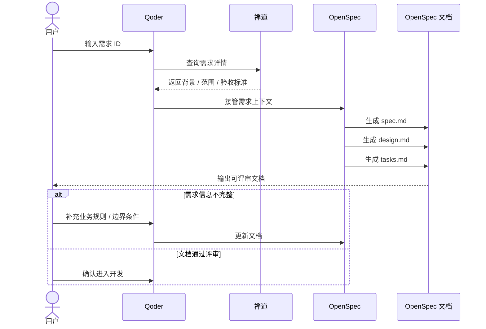
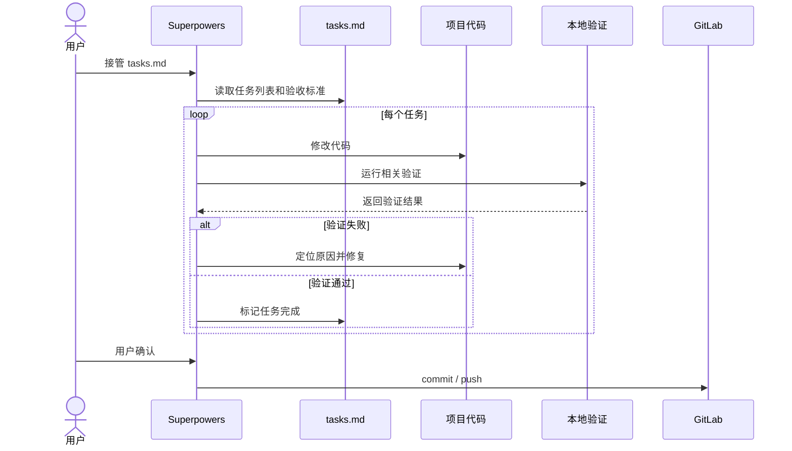
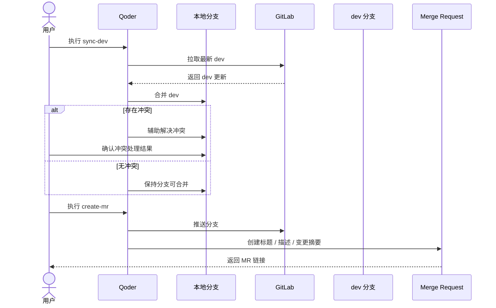
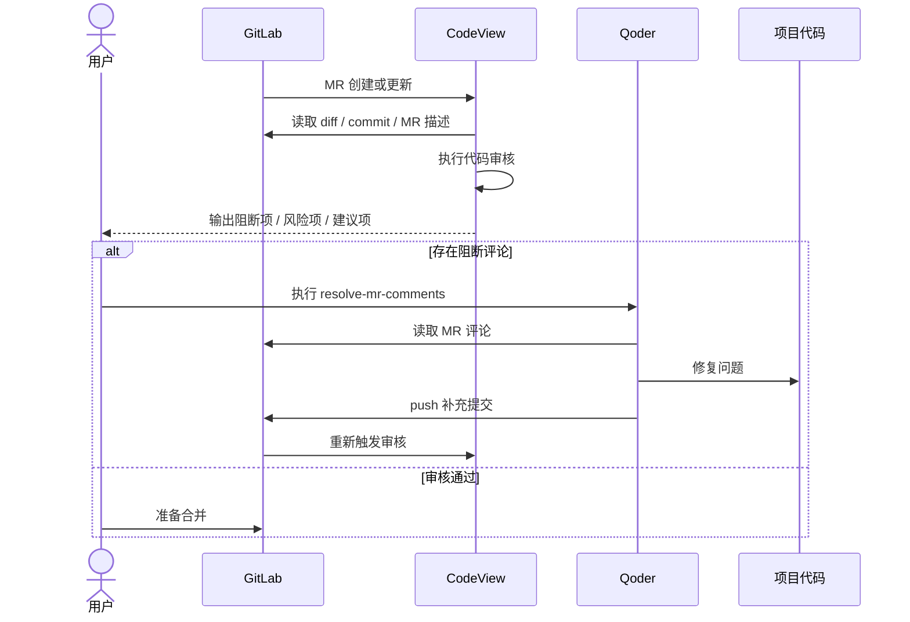
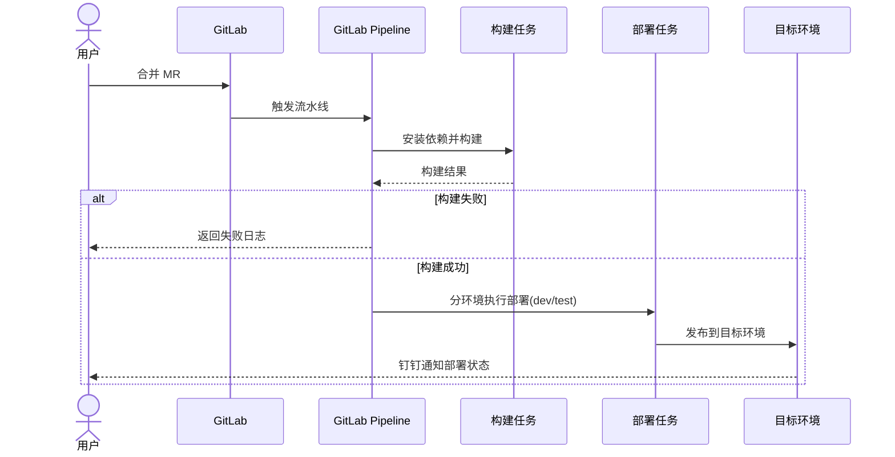
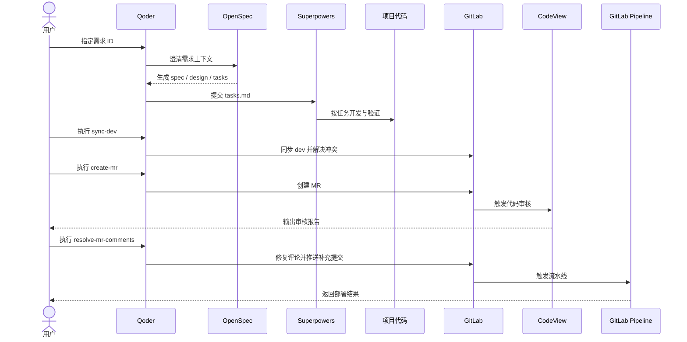

# AI 研发交付流程

本文基于项目已有的 AI 应用报告整理，目标是把"需求指定、文档生成、任务开发、合并、MR、审核、评论修复、流水线部署"串成一条可复用的工程闭环。

前提：需求已录入禅道，采用 [zentao-cli](https://www.npmjs.com/package/zentao-cli) 打通禅道系统


## 需求到文档

Qoder/Codex 负责拿到需求 ID，并把需求上下文交给 [OpenSpec](https://github.com/Fission-AI/OpenSpec)。OpenSpec 不直接写业务代码，而是生成可评审、可拆解、可追踪的开发文档。
扩展阅读：[其他SDD：spec-kit](https://github.com/github/spec-kit)

**Default quick path (core profile):**

```
/opsx:explore ──► /opsx:propose ──► /opsx:apply ──► /opsx:sync ──► /opsx:archive
   (optional)
```
**Expanded path (custom workflow selection):**

```
/opsx:new ──► /opsx:ff or /opsx:continue ──► /opsx:apply ──► /opsx:verify ──► /opsx:archive
```



OpenSpec产生的文档


```
openspec/
├── specs/              # Source of truth (your system's behavior)
│   └── <domain>/
│       └── spec.md
├── changes/            # Proposed updates (one folder per change)
│   └── <change-name>/
│       ├── proposal.md
│       ├── design.md
│       ├── tasks.md
│       └── specs/      # Delta specs (what's changing)
│           └── <domain>/
│               └── spec.md
└── config.yaml         # Project configuration (optional)
```

## `tasks.md` 到开发实现

[Superpowers](https://github.com/obra/superpowers) 接管 OpenSpec 产出的 `tasks.md` 后，按任务粒度推进开发。复杂任务先拆分，涉及缺陷时使用系统化调试，涉及实现时按任务完成代码、验证和自审。




### Superpower完整流程

Superpowers 是一个**纯 Skill 驱动的开发工作流插件**，核心价值在于：

1. **强制纪律**：通过 Iron Law + Red Flags 机制防止跳过设计、跳过测试、跳过验证
2. **完整工作流**：从头脑风暴→设计→计划→TDD 实现→代码审查→验证完成，覆盖开发生命周期
3. **子 Agent 协作**：通过分派隔离上下文的子 Agent 实现高质量并行开发和两阶段审查


## 同步 `dev` 与创建 MR

`sync-dev` 用于在创建 MR 前同步目标分支代码，降低 MR 阶段的冲突和流水线失败概率。`create-mr` 负责把本地分支转换成可审核的 GitLab MR。




## 代码审核与评论修复

`codeView` 负责对 MR 进行代码审核，重点识别阻断合并的问题。`resolve-mr-comments` 负责读取 MR 评论，按评论修复代码并补充提交，形成审核闭环。




## 流水线部署项目

MR 审核通过后进入合并和流水线部署。部署阶段关注流水线状态、部署环境、验证结果和失败回滚路径。




## 流程总览

| 阶段 | 入口 | 产物 |
| --- | --- | --- |
| 需求指定 | 在 Qoder 中指定需求 ID | 明确的需求上下文 |
| 文档生成 | OpenSpec 接管需求 | `spec.md`、`design.md`、`tasks.md` |
| 任务开发 | Superpowers 接管 `tasks.md` | 代码修改、验证记录 |
| 同步开发分支 | `sync-dev` | 已合并最新 `dev` 的工作分支 |
| 创建 MR | `create-mr` | GitLab Merge Request |
| 代码审核 | `codeView` | 审核报告、阻断项、建议项 |
| 评论修复 | `resolve-mr-comments` | 已处理的 MR 评论与补充提交 |
| 流水线部署 | GitLab Pipeline | 可验证的部署结果 |





## 建议

1. 需求类开发优先从需求 ID 进入，避免只靠口头描述生成代码，导致以后也不知道当时怎么描述的问题
2. OpenSpec 阶段先评审文档，再进入编码，减少需求边界不清导致的返工。
3. Superpowers 阶段围绕 `tasks.md` 推进，避免跳过验证和自审。
4. MR 前先执行 `sync-dev`，让冲突尽早暴露在本地。
5. MR 后使用 `codeView` 和 `resolve-mr-comments` 形成"审核-修复-复审"的闭环。


## 遇到的问题

#### 1. Skill 触发不可控（随机性）

- 多个 Skill 同时存在时，触发哪个 Skill 是不确定的，比如superpowers有很多skill，没有看到做TDD和subagent操作
- 缺乏明确的触发优先级机制

#### 2. Skill 边界不清晰（功能重叠）

- `openspec` 和 `Superpower` 都涉及需求讨论，职责划分模糊
- 目前写了一个Skill来衔接openspec和superpowers，还在测试阶段

#### 3. 开发粒度讨论？

- 当前直接对需求进行开发，前端和后端都是同一个需求描述，但又是要实现两套不同的代码，是否需要开发人员去拆解更细的task
- 是否需要 **需求 → Task 拆解 → 单 Task 开发** 的流水线机制


## 后续计划：Agent 工程化能力演进

后续建设重点从"单次 AI 辅助编码"升级为"可观测、可编排、可复用的 Agent 任务开发体系"。

核心演进方向可以概括为四个关键词：`prompt`、`context`、`harness`、`loop`。

| 能力 | 作用 |
| --- | --- |
| `prompt` | 没把话说清楚，模型就乱猜。解决"怎么说"。 |
| `context` | 话说清楚了，但模型不知道我们的业务背景信息。解决"给什么"。 |
| `harness` | 说清楚了信息也够了，但 Agent 跑长任务还是会偏。解决"谁来兜底"——把每次犯错就把修复沉淀进环境，让它结构上不可能再犯同样的错。 |
| `loop` | 我们需要按回车，解决"让它自己循环转"，执行交给 Agent，人去设计环境和判断结果 |


### agent架构图


## 结合 LangChain / LangGraph / Deep Agents / LangSmith 的开发路线

| 阶段   | 技术组件        | 目标                                   |
| ---- | ----------- | ------------------------------------ |
| 链式接入 | LangChain   | 把 GitLab、禅道、文件系统、测试命令、流水线查询封装为统一工具   |
| 流程编排 | LangGraph   | 将需求、OpenSpec、开发、MR、审核、修复、部署 建模为工作流程图 |
| 复杂执行 | Deep Agents | 多Agent协作开发                           |
| 观测评估 | LangSmith   | 调试和评估 效果，记录 trace、评估 Prompt等         |
