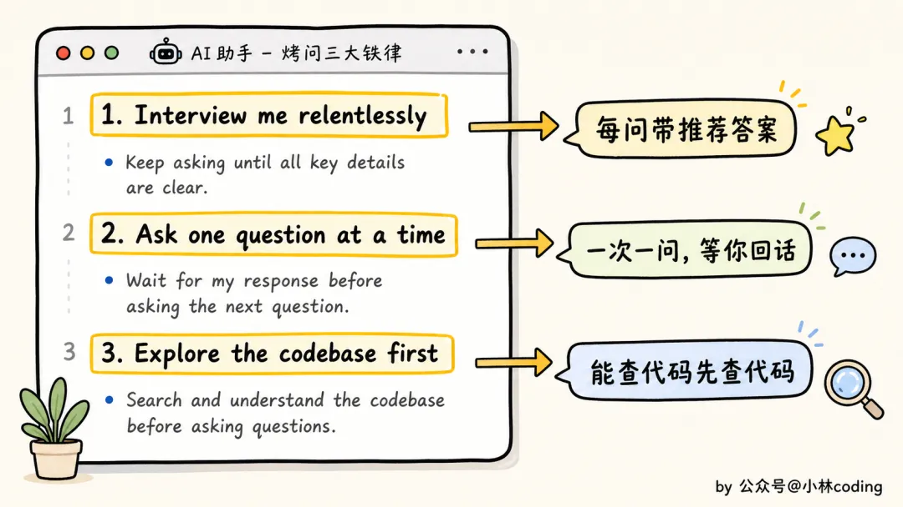
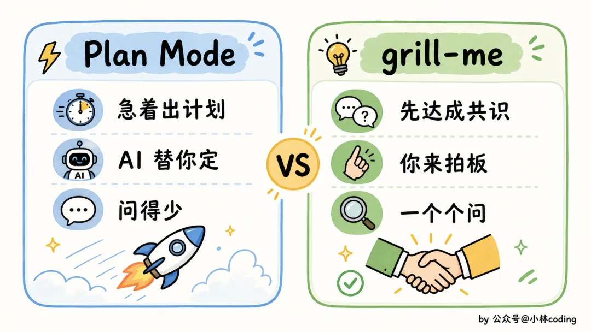
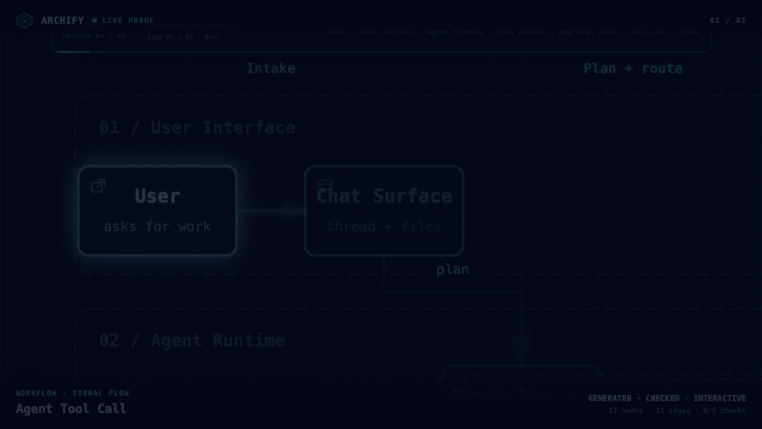

[Superpowers](https://github.com/obra/superpowers)

[OpenSpec](https://github.com/Fission-AI/OpenSpec)

[grill-me](https://github.com/mattpocock/skills)

[archify(绘图)](https://github.com/tt-a1i/archify)

## 1. [OpenSpec](https://github.com/Fission-AI/OpenSpec)

**OpenSpec是什么？**

OpenSpec 是一个面向 AI 编程助手（Claude Code、Codex、Cursor、Copilot 等）的 **Spec-Driven Development（SDD，规格驱动开发）框架**。

它的核心思想是：

> 先明确“要做什么”，再让 AI 写代码。

不是：

```
需求
 ↓
直接让 AI 写代码
```

而是：

```
需求
 ↓
Proposal（提案）
 ↓
Spec（规格）
 ↓
Design（设计）
 ↓
Tasks（任务）
 ↓
Code（实现）
```

OpenSpec 官方将其描述为：

> A lightweight, spec-driven framework for coding agents and CLIs.（一个轻量级的规格驱动开发框架）

---

### 1.1 OpenSpec 解决什么问题？

如果你经常用 Claude Code、Codex 或 Cursor，你可能遇到：

#### 1.1.1 问题1：AI 容易跑偏

例如：

```
给 MQTT 增加自动重连功能
```

AI 可能会：

- 修改 MQTT 层
- 修改业务层
- 修改配置格式
- 改日志系统

最后改了一大堆。

---

#### 1.1.2 问题2：需求丢失

几天后再开新会话：

```
为什么当时要这样设计？
```

没人知道。

因为信息都在聊天记录里。

---

#### 1.1.3 问题3：大项目上下文不够

对于你的项目：

```
MsgBus
├── MQTT
├── MySQL
├── Node.js Binding
├── Windows
├── Linux
```

几十万行代码以后：

```
让 AI 修改一个功能
```

AI 很容易遗漏：

- 历史约束
- 架构规则
- 已有设计

---

OpenSpec 的目标就是：

```
把需求和设计变成仓库中的长期资产
```

而不是：

```
留在聊天记录里
```


### 1.2 使用方式

**Quick Start**

安装 OpenSpec：
```cmd
npm install -g @fission-ai/openspec@latest
```

初始化：
```cmd
cd your-project
openspec init
```

**Default quick path (core profile):**

```
/opsx:explore ──► /opsx:propose ──► /opsx:apply ──► /opsx:sync ──► /opsx:archive
   (optional)
```

**Expanded path (custom workflow selection):**

```
/opsx:new ──► /opsx:ff or /opsx:continue ──► /opsx:apply ──► /opsx:verify ──► /opsx:archive
```

## 2. [Superpowers](https://github.com/obra/superpowers)

**Superpowers 是什么？**

Superpowers（通常指 Obra 团队的 Superpowers for Claude Code/Cursor）本质上不是一个开发框架，而是：

> 一套可复用的 AI Agent Skills（技能库）和工程实践集合。


可以把它理解成：

```
OpenSpec = 管理需求和规格
Superpowers = 教 AI 如何干活
```

或者：

```
OpenSpec = 产品经理 + 架构师
Superpowers = 高级工程师
```


### 2.1 它解决什么问题？

很多 AI Coding Agent 的典型问题：

#### 2.1.1 问题1：上来就写代码

例如：

```
帮我给 MQTT 增加自动重连
```

Agent 可能：

```
看两眼代码
↓
开始改
↓
改坏
```

---

#### 2.1.2 问题2：不会系统调试

例如：

```
程序偶尔崩溃
```

很多 Agent 会：

```
猜原因
↓
改代码
↓
再猜
```

而不是：

```
收集证据
↓
定位问题
↓
验证假设
↓
修复
```

---

#### 2.1.3 问题3：不会做大型任务

例如：

```
重构 MQTT 模块
```

Agent 容易：

```
一次改几千行
```

导致：

- 上下文爆炸
- 修改失控
- Bug增加

---

Superpowers 的目标是：

```
把优秀工程师的工作习惯固化成 Agent 技能
```

---

### 2.2 核心组成

Superpowers 的核心是：

```
superpowers/
├── skills/
├── commands/
├── templates/
└── workflows/
```

不同版本目录可能略有差异，但思想类似。


## 3. superpowers vs openspec


### 3.1 为什么会感觉重叠？

因为两者都包含：

```
分析需求
↓
制定计划
↓
实现代码
↓
验证结果
```

但关注点不同：

**OpenSpec**

关注：

```
为什么做
做什么
验收标准是什么
```

例如：

```
Feature: MQTT自动重连

Requirements
- 网络恢复后30秒内自动重连
- 保持订阅状态

Acceptance Criteria
- ...
```

---

**SuperPowers**

关注：

```
怎么做
如何保证质量
```

例如：

```
使用TDD
先写失败测试
再实现
最后重构
```

### 3.2 推荐工作流

```
需求不清楚：
OpenSpec explore/propose

需求确认后：
OpenSpec 生成 design/tasks/spec

开始编码：
使用 Superpowers 的 TDD/implementation/debugging 技能

完成后：
OpenSpec sync/archive
```

### 3.3 总结

| 维度   | OpenSpec                                        | Superpowers                |
| ---- | ----------------------------------------------- | -------------------------- |
| 核心定位 | 规格/需求驱动开发                                       | Agent 技能/工作方法              |
| 解决问题 | “要做什么、为什么做、验收标准是什么”                             | “AI 怎么做得更稳：TDD、调试、计划、执行纪律” |
| 产物   | `proposal.md`、`design.md`、`tasks.md`、spec delta | reusable skills / 方法论指令    |
| 更适合  | 老项目、多人协作、需求变更可追踪                                | 提升 AI 编码质量、测试优先、复杂实现过程     |

## 4. [grill-me](https://github.com/mattpocock/skills)

[参考小林coding](https://mp.weixin.qq.com/s?__biz=MzUxODAzNDg4NQ==&mid=2247559688&idx=1&sn=8cca5ced930d5f728dc0780e826d7267&scene=21&poc_token=HAIhV2qjxfJPza1vDjqaxESIJJ6moLXARy9Slrm5)

安装：```
```
npx skills@latest add mattpocock/skills
```

在 agent 内运行 `/setup-matt-pocock-skills`，它将：
- 询问您要使用哪个问题跟踪器（GitHub、Linear或本地文件）；
- 询问您在对工单进行分类时应用哪些标签（`/triage`使用标签）；
- 询问您要将我们创建的任何文档保存到何处；

几个skill的使用流程：
```
grill-me：核对需求，灵魂拷问
(grill-with-docs)：文档落盘
	|
  to-spec：将当前对话转换为spec并将其发布到问题跟踪器
	|
to-tickets：对spec进行工单拆分成多个任务（如果spec简单可以不进行工单拆分）
	|
 implement：实现spec或者tickets
```

```
/grill-me（拷问澄清）→ /to-spec（发布规格）
	├─ 小活：/implement（直接按 spec 做）
	└─ 大活：/to-tickets（拆票）→ /implement × N（每次一张票）
```

生成的文档位于当前工程根目录 `..scratch` 下。

`/handoff` 是**上下文交接**工具：把当前这段对话压缩成一份交接文档，让一个全新的 agent（新会话、零上下文）能接着干下去。

这个 skill 也是一个 vibe coding 神器，为什么这么说？

我们用 AI 编程，最难的往往不是写代码，而是一开始压根没把想法说清楚。你脑子里就一个模糊的念头，直接丢给 Claude Code，它二话不说就唰唰唰建文件、写代码、装依赖，进度条跑得飞快。

结果东西出来，你一看，傻眼了，根本不是你想要的。想改，一改牵一发动全身，最后干脆推倒重来。

问题出在哪？出在 AI <font color="blue">太听话</font>了。

你给的需求本来就模糊，里面藏着几十个你自己都没想清楚的细节。AI 不会拦着你问，默认你都想好了，于是把这些空缺<font color="blue">全替你猜了默认值</font>，闷头就干。

猜对一两个，猜错一大片，返工自然就来了。

而 `grill-me`干的，就是反过来的事：它不急着动手，先揪着你一顿<font color="blue">审问</font>，把你没想明白的地方一个个逼出来。

grill 这词英文里就是「拷问、盘问」，名字起得相当直白。

### 4.1 一个只有三句话的 skill，凭什么让人上头？

先说说它是谁做的。`grill-me`是海外一个叫 Matt Pocock 的开发者写的，放在他的 `mattpocock/skills`仓库里，最近在圈子里挺火。

火的原因有点反常识：<font color="blue">这玩意真正的核心，拢共就三小段大白话</font>。

我把它的核心指令扒了出来，开头那段写着名字和用途的术语叫 frontmatter 先不管，正文就这么几句：
```
Interview me relentlessly about every aspect of this plan
until we reach a shared understanding. Walk down each branch
of the design tree, resolving dependencies between decisions
one-by-one. For each question, provide your recommended answer.

Ask the questions one at a time, waiting for feedback on each
question before continuing. Asking multiple questions at once
is bewildering.

If a question can be answered by exploring the codebase,
explore the codebase instead.
```
就这么点。说人话就是，它其实是在给 Claude 下三道命令。

•   第一句：<font color="blue">给我往死里盘问这个方案的每一个细节，一直问到咱俩想的是同一件事为止</font>。顺着「设计树」一根一根枝丫往下走，每个决定都当场定死，再进下一个。而且每问一个问题，你得同时给出你<font color="blue">推荐的答案</font>。

•   第二句：<font color="blue">一次只准问一个，问完必须等我回话，才能接着问下一个</font>。它还特意补了句理由，一口气甩你一堆问题，只会把人问懵。

•   第三句：<font color="blue">如果一个问题去翻代码就能自己搞清楚，那就别问我，自己去翻</font>。

你看，一句废话没有。它把 Claude 从一个「你说啥我做啥」的执行工具，掰成了一个揪着你不放的面试官。

这里其实藏着一个特别值得说的点。你看它才三句话，没有脚本，没有一堆配置，就是几行大白话。可它能干的事，比很多写得老长老长的 skill 还实在。

为什么？因为它没在教 Claude「怎么做」，它在改 Claude「用什么姿态跟你说话」。这三句话，本质是一个开关，啪一下，把人和 AI 的关系整个掉了个个儿。

平时是你提需求、它执行。现在变成它提问、你拍板。

### 4.2 为什么非得「一次只问一个」？

我第一次看到「一次只问一个问题」这条，说实话有点不以为然。不就是省点事嘛，一次多问几个不是更快？

后来我才反应过来，这条恰恰是整个 skill 最聪明的地方。

先讲背后的道理。`grill-me`里有个词叫「设计树」（design tree），这不是它发明的，是几十年前一位叫 Fred Brooks 的软件界老前辈提出来的。

意思是说，你做任何一个东西，背后都是一棵<font color="blue">决定组成的树</font>。你先做一个大决定，这个大决定又岔出好几个小决定，小决定底下再岔出更小的。

关键就在这个「岔」字上。

真正让你返工返到吐血的，往往不是哪个你认真纠结过的决定，而是某个<font color="blue">你压根没意识到自己在选的岔路</font>。

你以为那地方没得选，其实那是个岔口，你随手挑了一条，等走到底发现不对，回头一看，从那个岔口往后的活全白干了。

打个装修的比方你就懂了。

你要装修，最上游的决定是「整体什么风格」。定了风格，才轮到墙刷什么颜色、买什么家具。

你要是风格还没定，就先跑去挑了一堆家具，回头定了个跟家具八字不合的风格，那家具是不是白买了？

<font color="blue">上游的决定不定死，下游全是空中楼阁。  </font>

这就是为什么它非要一根枝丫一根枝丫地走，一次只掐一个。它得先把你最上游、最模糊的那个决定钉死，才敢往下问。

顺序乱了，问了也白问。

### 4.3 总结

`grill-me`不是万金油，别啥事都拉来审一遍。

改个错别字、调个颜色、加个一眼能看穿的小功能，你要还召唤它来审问，那它一本正经问你一串，纯属折磨，你会被烦死。

它真正该出场的时候，是那种<font color="blue">要花你好几个小时、而且一旦方向定错、返工成本很高</font>的活。写代码之前是最便宜的纠错时机，这时候多聊半小时，比事后重写一天强太多。

对了，它审的也不一定非得是代码。

你有个产品点子、一个还没想透的选题、一份课程大纲，任何背后有「一棵决策树」的东西，都能丢给它审一审。我自己就试过让它审我的选题方向，被问出好几个我原本压根没考虑到的角度。

说到底，`grill-me`干的这件事，是把 AI 从一个<font color="blue">猜你心思</font>的执行工具，变成一个<font color="blue">逼你把心思说清楚</font>的搭档。

它问的每一个问题，其实都是你本该问自己、却又懒得问的。它只是替你，把这道功课补上了。


## 5. [archify](https://github.com/tt-a1i/archify)

**在对话里，把代码仓库或系统描述变成漂亮、可靠、可交互的系统地图。**

Archify 是适用于 Raven、Cursor、Claude Code、Codex CLI 和 OpenCode 的 Agent Skill。给它系统描述或代码仓库，就能得到可交互、可分享的专业技术地图。

- **打开就是成品** —— 五种技术图、四套视觉预设、深浅主题，以及显式启用的有限动态
- **合并前先看清架构变化** —— 把两份已校验快照对比为 Before / Delta / After，准确区分新增、删除、语义变化、移动和重路由
- **每次探索都有依据** —— 搜索节点、按需打开版本校验过的源码、追踪作者定义的上下游可达范围与精确路径、对比角色、播放故事，但不编造拓扑
- **一个文件即可放心交付** —— Typed JSON IR 和确定性校验生成独立 HTML，并支持 PNG、SVG、WebM 与 1200×630 分享卡片

安装：
```bash
  npx skills add tt-a1i/archify -g
```
按照控制台提示进行操作，选择自己的agent工具进行安装。

使用：
```
使用 archify 生成一张高层运行时架构图
```

先画一个边界清楚的视图：
```
分析这个仓库，然后使用 archify 生成一张高层运行时架构图。
只保留 8–12 个核心组件，突出一条主要路径，并标出外部依赖与信任边界。
辅助信息放进说明卡片，不要继续增加连线。
```
如果只想解释一条调用链：
```
使用 archify 画出这条登录流程：Browser -> Web App -> API -> JWT 校验 ->
Redis Session 查询 -> PostgreSQL 回源。把缓存未命中作为次要路径。
```

**选择合适的图表**

| 类型               | 最适合                   | Prompt 中应包含    |
| ---------------- | --------------------- | -------------- |
| **Architecture** | 组件、服务、存储和系统边界         | 范围、核心组件、主要路径   |
| **Workflow**     | CI/CD、审批、工具调用、Runbook | 参与者、顺序、分支、异常   |
| **Sequence**     | API 调用、缓存回源、鉴权、异步链路   | 调用方、被调用方、返回、时序 |
| **Data Flow**    | 数据管线、血缘、PII、下游消费者     | 来源、转换、存储、边界    |
| **Lifecycle**    | 状态、重试、等待、终态           | 状态、事件、重试与取消路径  |

**为什么用 Archify**

- **用布局判断代替通用自动布局** —— Agent 根据故事选择层级、留白、线路和强调关系；共享的自动端点会确定性展开，不再让多支箭头堆在同一个中点。
- **Typed JSON IR** —— 每种 Renderer 模式都有 Schema 和可复现的源文件。
- **原子交付前校验** —— Schema、布局、HTML/SVG、线路和标签到其他路径的净空检查必须全部通过，Showcase 成品才会替换上一份可信结果。
- **失败也有结构化修复回执** —— `validate --json` 和 `deliver --json` 会返回稳定规则码、准确对象、测量证据和真正支持的修复旋钮，不再让 Agent 从 Node 堆栈或自由文本里猜。
- **保留最后好图的实时预览** —— 可选桌面循环只监听一个 JSON；只有最新候选通过全部门禁才刷新，半写入或无效保存时继续显示上一份验证成品。
- **交互不编造拓扑** —— 聚焦、上下游可达范围、精确路径、角色对比和故事都复用作者定义的节点与关系，也不把图上可达误报成真实运行时影响。
- **只在需要时附源码证据** —— 有证据的 Architecture 节点会显示 `SRC n`，并可打开由 Git 校验、固定到公开 commit 的文件与行号；普通成品不携带源码信息。
- **结果默认便携** —— 一个 HTML 文件即可分享；导出永远是完整原图，不携带临时 Viewer 状态。

Archify 不是通用绘图编辑器，也不是 Mermaid 主题；它负责把技术意图变成可交流的成品。



