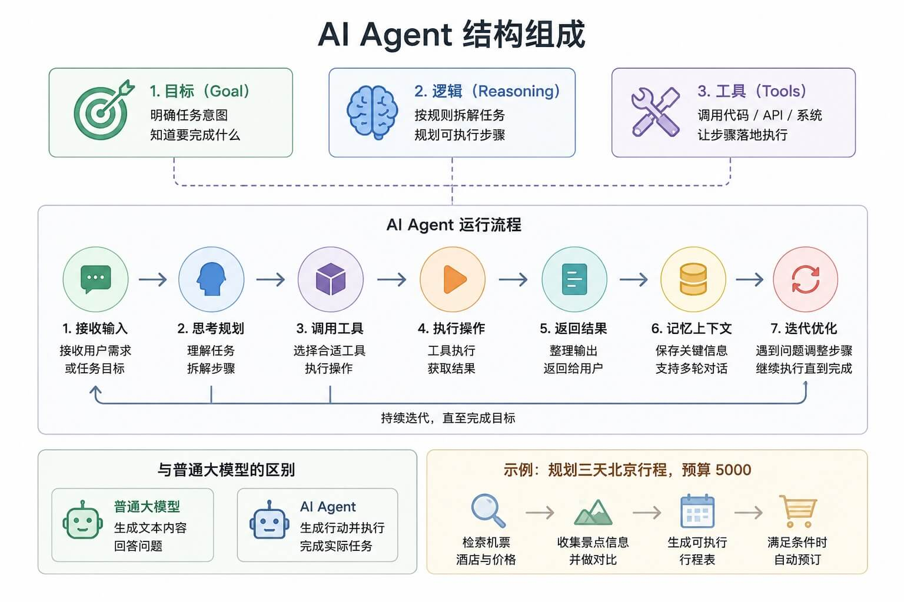
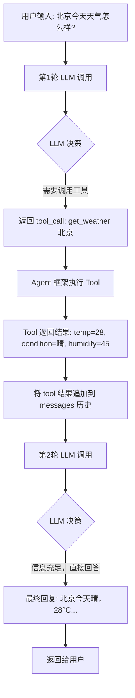
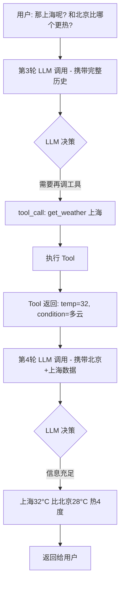
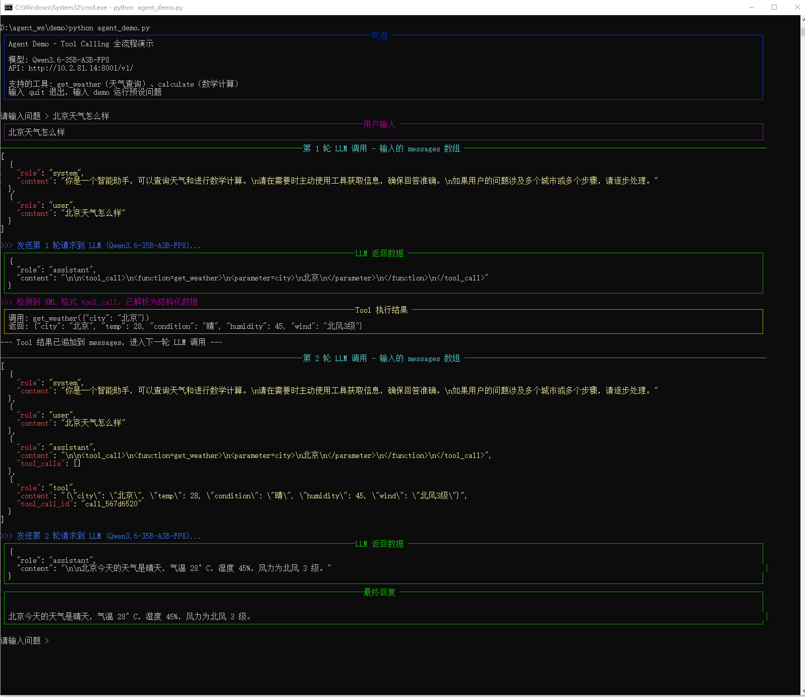

# agent介绍

## 什么是 Agent？

Agent 就是一个能干活的智能助手。

Agent = LLM (大脑) + Planning (规划) + Tool use (执行) + Memory (记忆)。

学习 Agent 需要思维转变： 从对话框问答进化为目标驱动的任务执行。

传统的软件程序遵循固定的指令流程：输入 → 处理 → 输出，而 AI Agent 则更像一个有自主性的员工，它能够：

- **理解任务目标**：明白你想要什么结果
- **制定计划**：思考如何达成目标
- **使用工具**：调用各种资源和 API
- **自我调整**：根据反馈优化策略
- **持续执行**：直到完成任务或遇到无法解决的问题

**类比理解：**

- 传统程序 = 自动售货机：投币 → 按按钮→ 出商品
- AI Agent = 私人助理：告诉需求 → 助理规划 → 完成任务并汇报

---

**核心结构：**

- **目标（Goal）：** 知道要完成什么
- **决策（Reasoning）：** 规划执行步骤
- **工具（Tools）：** 调用 API、代码或系统完成任务

**工作流程：**

输入 → 思考 → 调用工具 → 执行 → 返回结果 → 持续迭代

**与普通大模型区别：**

- 大模型：输出内容
- Agent：输出结果，并推动执行

比如我们在与 AI Agent 对话，输出：规划三天北京旅行，预算 5000，智能体就会完成以下任务：

- 拆解需求
- 查询机票、酒店、景点
- 生成行程方案
- 满足条件时继续完成预订

## 简单示例：天气查询 Agent

假设用户问：**"北京今天天气怎么样？"**

Agent 的处理流程如下：

### 第 1 轮 LLM 调用

**输入给 LLM 的消息：**
```json
{
  "messages": [
    {"role": "system", "content": "你是一个助手，可以查询天气。"},
    {"role": "user", "content": "北京今天天气怎么样？"}
  ],
  "tools": [
    {
      "name": "get_weather",
      "description": "获取指定城市的天气信息",
      "parameters": {
        "type": "object",
        "properties": {
          "city": {"type": "string", "description": "城市名称"}
        },
        "required": ["city"]
      }
    }
  ]
}
```

**LLM 返回（tool_call）：**
```json
{
  "role": "assistant",
  "content": null,
  "tool_calls": [
    {
      "id": "call_001",
      "type": "function",
      "function": {
        "name": "get_weather",
        "arguments": "{\"city\": \"北京\"}"
      }
    }
  ]
}
```
LLM 没有直接回答，而是决定调用 `get_weather` 工具。

**执行 Tool**

Agent 框架拦截到 tool_call，执行对应的函数：
```json
// Tool 执行结果
{
  "role": "tool",
  "tool_call_id": "call_001",
  "content": "{\"city\": \"北京\", \"temp\": 28, \"condition\": \"晴\", \"humidity\": 45}"
}
```
### 第 2 轮 LLM 调用

**输入给 LLM 的消息（完整对话历史）：**
```json
{
  "messages": [
    {"role": "system", "content": "你是一个助手，可以查询天气。"},
    {"role": "user", "content": "北京今天天气怎么样？"},
    {"role": "assistant", "content": null, "tool_calls": [{"id": "call_001", "function": {"name": "get_weather", "arguments": "{\"city\": \"北京\"}"}}]},
    {"role": "tool", "tool_call_id": "call_001", "content": "{\"city\": \"北京\", \"temp\": 28, \"condition\": \"晴\", \"humidity\": 45}"}
  ]
}
```

**LLM 最终返回：**
```json
{
  "role": "assistant",
  "content": "北京今天天气晴朗，气温28°C，湿度45%，适合外出活动。"
}
```

### 完整流程图


### 多轮 Tool 调用的场景

如果用户接着问：**"那上海呢？和北京比哪个更热？"**



关键点：**每轮 LLM 调用都携带完整的 messages 历史**，包括之前的 tool_call 和 tool 结果，这样 LLM 才能"记住"上下文。

## agent main loop（伪代码）

```python
def agent_loop(user_input, tools, max_turns=10):
    messages = [
        {"role": "system", "content": "你是一个助手"},
        {"role": "user", "content": user_input}
    ]
    
    for turn in range(max_turns):
        # 调用 LLM
        response = llm.chat(messages=messages, tools=tools)
        
        # LLM 返回了 tool_call → 执行工具
        if response.has_tool_calls():
            messages.append(response.message)  # 记录 assistant 的决策
            for tool_call in response.tool_calls:
                result = execute_tool(tool_call)      # 执行具体工具
                messages.append({                    # 将结果追加到历史
                    "role": "tool",
                    "tool_call_id": tool_call.id,
                    "content": result
                })
        
        # LLM 直接回复 → 结束循环
        else:
            return response.content
```

**总结：** Agent 就是一个 `LLM → 判断 → 调Tool → 结果回传 → LLM → ...` 的循环，直到 LLM 认为信息足够可以直接回答为止。每轮调用的 messages 数组就是 Agent 的"记忆"，包含了所有 tool 数据和中间结果。

## agent demo

requirements.txt
```txt
openai>=1.0.0
rich>=13.0.0
```

agent_demo.py
```python
"""
Agent Demo - 使用 OpenAI 风格 API 实现完整的 Tool Calling Agent

演示内容:
  1. 定义 Tools（天气查询、数学计算）
  2. Agent 循环：LLM 决策 → 调用 Tool → 结果回传 → LLM 再决策
  3. 每一轮都打印完整的 messages 数据，展示 tool_call 和 tool result 的结构

使用方式:
  1. 安装依赖:  pip install openai rich
  2. 设置环境变量:
       export OPENAI_API_KEY="your-api-key"
       export OPENAI_BASE_URL="http://10.2.81.14:8001/v1"   # 可选，兼容任意 OpenAI 风格 API
  3. 运行:  python agent_demo.py
"""

import os
import re
import json
import uuid
import random
from typing import Any

from openai import OpenAI
from rich.console import Console
from rich.panel import Panel
from rich.syntax import Syntax
from rich.rule import Rule

# ─────────────────────────────────────────────────────────
# 初始化
# ─────────────────────────────────────────────────────────
console = Console()

client = OpenAI(
    api_key=os.getenv("OPENAI_API_KEY", "EMPTY"),
    base_url=os.getenv("OPENAI_BASE_URL", "http://10.2.81.14:8001/v1"),
)
MODEL = os.getenv("OPENAI_MODEL", "Qwen3.6-35B-A3B-FP8")  # 默认模型，可通过环境变量覆盖


# ─────────────────────────────────────────────────────────
# 第一部分：定义 Tools（工具函数 + JSON Schema）
# ─────────────────────────────────────────────────────────

# ---- 工具函数 ----

def get_weather(city: str) -> str:
    """模拟天气查询接口，返回 JSON 字符串"""
    # 模拟数据，实际项目中这里会调用真实的天气 API
    mock_data = {
        "北京": {"temp": 28, "condition": "晴", "humidity": 45, "wind": "北风3级"},
        "上海": {"temp": 32, "condition": "多云", "humidity": 70, "wind": "东南风2级"},
        "广州": {"temp": 35, "condition": "雷阵雨", "humidity": 85, "wind": "南风2级"},
        "成都": {"temp": 26, "condition": "阴", "humidity": 60, "wind": "无风"},
    }
    data = mock_data.get(city, {"temp": random.randint(20, 35), "condition": "晴", "humidity": 50, "wind": "微风"})
    return json.dumps({"city": city, **data}, ensure_ascii=False)


def calculate(expression: str) -> str:
    """安全的数学计算，支持基本运算"""
    # 仅允许安全字符
    allowed = set("0123456789+-*/.() ")
    if not all(c in allowed for c in expression):
        return json.dumps({"error": "不安全的表达式"}, ensure_ascii=False)
    try:
        result = eval(expression, {"__builtins__": {}})
        return json.dumps({"expression": expression, "result": result}, ensure_ascii=False)
    except Exception as e:
        return json.dumps({"error": str(e)}, ensure_ascii=False)


# ---- 工具名 → 函数的映射 ----
TOOL_REGISTRY: dict[str, callable] = {
    "get_weather": get_weather,
    "calculate": calculate,
}

# ---- OpenAI function calling 格式的 Tool Schema ----
TOOLS = [
    {
        "type": "function",
        "function": {
            "name": "get_weather",
            "description": "获取指定城市的实时天气信息，包括温度、天气状况、湿度和风力",
            "parameters": {
                "type": "object",
                "properties": {
                    "city": {
                        "type": "string",
                        "description": "城市名称，如：北京、上海、广州",
                    }
                },
                "required": ["city"],
            },
        },
    },
    {
        "type": "function",
        "function": {
            "name": "calculate",
            "description": "计算数学表达式，支持加减乘除和括号运算",
            "parameters": {
                "type": "object",
                "properties": {
                    "expression": {
                        "type": "string",
                        "description": "数学表达式，如：(28 + 32) / 2",
                    }
                },
                "required": ["expression"],
            },
        },
    },
]


# ─────────────────────────────────────────────────────────
# 第二部分：XML 格式 tool_call 解析器（兼容非原生模型）
# ─────────────────────────────────────────────────────────

LT = chr(60)   # <
GT = chr(62)   # >


def parse_xml_tool_calls(text: str) -> list[dict] | None:
    """
    解析 XML 格式的 tool_call 文本，兼容不支持原生 tool_calls 的模型。
    返回与 OpenAI tool_calls 相同结构的列表，如果没有找到则返回 None。
    """
    tc_open = LT + "tool_call" + GT
    tc_close = LT + "/tool_call" + GT
    fn_prefix = LT + "function="
    fn_suffix = GT
    fn_close = LT + "/function" + GT
    p_open = LT + "parameter="
    p_close = LT + "/parameter" + GT

    blocks = []
    idx = 0
    while True:
        start = text.find(tc_open, idx)
        if start == -1:
            break
        end = text.find(tc_close, start)
        if end == -1:
            break
        blocks.append(text[start + len(tc_open):end].strip())
        idx = end + len(tc_close)

    if not blocks:
        return None

    results = []
    for block in blocks:
        if not block.startswith(fn_prefix):
            continue
        name_end = block.find(fn_suffix, len(fn_prefix))
        if name_end == -1:
            continue
        func_name = block[len(fn_prefix):name_end].strip()
        fn_content = block[name_end + len(fn_suffix):].strip()
        if fn_content.endswith(fn_close):
            fn_content = fn_content[:-len(fn_close)].strip()

        args = {}
        pidx = 0
        while True:
            ps = fn_content.find(p_open, pidx)
            if ps == -1:
                break
            arg_end = fn_content.find(GT, ps + len(p_open))
            if arg_end == -1:
                break
            arg_name = fn_content[ps + len(p_open):arg_end].strip()
            val_start = arg_end + 1
            val_end = fn_content.find(p_close, val_start)
            if val_end == -1:
                break
            arg_val = fn_content[val_start:val_end].strip()
            args[arg_name] = arg_val
            pidx = val_end + len(p_close)

        call_id = "call_" + str(uuid.uuid4())[:8]
        results.append({
            "id": call_id,
            "type": "function",
            "function": {
                "name": func_name,
                "arguments": json.dumps(args, ensure_ascii=False),
            },
        })

    return results if results else None


# ─────────────────────────────────────────────────────────
# 第三部分：辅助函数（打印和日志）
# ─────────────────────────────────────────────────────────

def print_messages(messages: list[dict], turn: int) -> None:
    """打印当前完整的 messages 历史，展示每轮 LLM 调用时传入的数据"""
    console.print(Rule(f"[bold cyan]第 {turn} 轮 LLM 调用 - 输入的 messages 数组[/bold cyan]"))
    # 精简显示，省略过长的内容
    display = []
    for msg in messages:
        item = {"role": msg["role"]}
        if "content" in msg and msg["content"]:
            item["content"] = msg["content"][:200] + ("..." if len(msg["content"]) > 200 else "")
        if "tool_calls" in msg:
            item["tool_calls"] = [
                {
                    "id": tc["id"],
                    "function": {
                        "name": tc["function"]["name"],
                        "arguments": tc["function"]["arguments"],
                    },
                }
                for tc in msg["tool_calls"]
            ]
        if "tool_call_id" in msg:
            item["tool_call_id"] = msg["tool_call_id"]
        display.append(item)

    console.print(Syntax(json.dumps(display, ensure_ascii=False, indent=2), "json", theme="monokai"))


def print_llm_response(response: Any) -> None:
    """打印 LLM 返回的完整数据"""
    msg = response.choices[0].message
    data = {"role": "assistant", "content": msg.content}
    if msg.tool_calls:
        data["tool_calls"] = [
            {
                "id": tc.id,
                "function": {"name": tc.function.name, "arguments": tc.function.arguments},
            }
            for tc in msg.tool_calls
        ]
    console.print(Panel(Syntax(json.dumps(data, ensure_ascii=False, indent=2), "json", theme="dracula"),
                        title="[bold green]LLM 返回数据[/bold green]", border_style="green"))


def print_tool_result(tool_name: str, arguments: dict, result: str) -> None:
    """打印工具执行的结果"""
    console.print(Panel(
        f"[bold]调用:[/bold] {tool_name}({json.dumps(arguments, ensure_ascii=False)})\n"
        f"[bold]返回:[/bold] {result}",
        title="[bold yellow]Tool 执行结果[/bold yellow]",
        border_style="yellow",
    ))


# ─────────────────────────────────────────────────────────
# 第四部分：Agent 核心循环
# ─────────────────────────────────────────────────────────

def run_agent(user_input: str, max_turns: int = 10) -> str:
    """
    Agent 核心循环：
      1. 将用户输入加入 messages
      2. 调用 LLM（携带 messages + tools）
      3. 如果 LLM 返回 tool_calls → 执行工具 → 将结果追加到 messages → 回到第 2 步
      4. 如果 LLM 直接回复文本 → 返回给用户
    """
    messages = [
        {
            "role": "system",
            "content": (
                "你是一个智能助手，可以查询天气和进行数学计算。\n"
                "请在需要时主动使用工具获取信息，确保回答准确。\n"
                "如果用户的问题涉及多个城市或多个步骤，请逐步处理。"
            ),
        },
        {"role": "user", "content": user_input},
    ]

    console.print(Panel(f"[bold]{user_input}[/bold]", title="[bold magenta]用户输入[/bold magenta]", border_style="magenta"))

    for turn in range(1, max_turns + 1):
        # ── 打印本轮调用前的完整 messages ──
        print_messages(messages, turn)

        # ── 调用 LLM ──
        console.print(f"\n[bold blue]>>> 发送第 {turn} 轮请求到 LLM ({MODEL})...[/bold blue]")
        response = client.chat.completions.create(
            model=MODEL,
            messages=messages,
            tools=TOOLS,
            tool_choice="auto",  # LLM 自主决定是否调用工具
        )

        assistant_msg = response.choices[0].message
        print_llm_response(response)

        # ── 提取 tool_calls：优先用原生格式，回退到 XML 解析 ──
        tool_calls = assistant_msg.tool_calls
        xml_parsed = None
        if not tool_calls and assistant_msg.content:
            xml_parsed = parse_xml_tool_calls(assistant_msg.content)

        # ── 情况 A：有 tool_calls（原生 或 XML 解析）→ 执行工具 ──
        if tool_calls or xml_parsed:
            messages.append(assistant_msg.model_dump())

            calls_to_process = []
            if tool_calls:
                for tc in tool_calls:
                    calls_to_process.append({
                        "id": tc.id,
                        "function": {"name": tc.function.name, "arguments": tc.function.arguments},
                    })
            elif xml_parsed:
                calls_to_process = xml_parsed
                console.print("[bold magenta]>>> 检测到 XML 格式 tool_call，已解析为结构化数据[/bold magenta]")

            for call in calls_to_process:
                func_name = call["function"]["name"]
                func_args = json.loads(call["function"]["arguments"])

                if func_name in TOOL_REGISTRY:
                    result = TOOL_REGISTRY[func_name](**func_args)
                else:
                    result = json.dumps({"error": f"未知工具: {func_name}"}, ensure_ascii=False)

                print_tool_result(func_name, func_args, result)

                messages.append({
                    "role": "tool",
                    "tool_call_id": call["id"],
                    "content": result,
                })

            console.print("[dim]--- Tool 结果已追加到 messages，进入下一轮 LLM 调用 ---[/dim]\n")

        # ── 情况 B：LLM 直接回复文本 → 结束循环 ──
        else:
            console.print(Panel(
                f"[bold]{assistant_msg.content}[/bold]",
                title="[bold green]最终回复[/bold green]",
                border_style="green",
            ))
            return assistant_msg.content or ""

    return "达到最大轮次限制，Agent 停止。"


# ─────────────────────────────────────────────────────────
# 第五部分：交互式入口
# ─────────────────────────────────────────────────────────

DEMO_QUESTIONS = [
    "北京今天天气怎么样？",
    "北京和上海哪个更热？温差是多少度？",
    "帮我算一下：北京、上海、广州三个城市的平均温度是多少？",
]

if __name__ == "__main__":
    console.print(Panel(
        "[bold]Agent Demo - Tool Calling 全流程演示[/bold]\n\n"
        f"模型: {MODEL}\n"
        f"API: {client.base_url}\n\n"
        "支持的工具: get_weather（天气查询）、calculate（数学计算）\n"
        "输入 quit 退出，输入 demo 运行预设问题",
        title="欢迎",
        border_style="blue",
    ))

    while True:
        try:
            user_input = input("\n请输入问题 > ").strip()
        except (EOFError, KeyboardInterrupt):
            break

        if not user_input:
            continue
        if user_input.lower() == "quit":
            console.print("[dim]再见！[/dim]")
            break
        if user_input.lower() == "demo":
            for q in DEMO_QUESTIONS:
                console.print(Rule())
                run_agent(q)
                console.print()
            continue

        run_agent(user_input)

```

**效果截图：**

