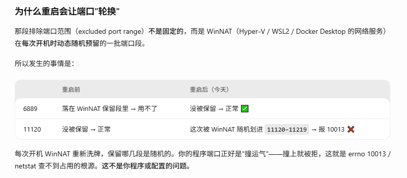

# 端口占用问题

一般端口占用都可以通过以下命令查询：

`Linux:`
```bash
netstat -ano | grep 1883
```

`Windows:`
```bash
netstat -ano | findstr 1883
```

查看端口被哪个程序占用，然后确认端口占用信息。

在windows下，如果发现端口被没有被占用，但是使用端口时，出现：`Thrift Server exception: Could not bind: errno = 10013, listen port: 11120` 的错误。

端口 11120 报 errno 10013（Windows 上是 `WSAEACCES` 权限被拒绝），但 netstat 又查不到占用——这是 Windows 上非常典型的现象。最可能的原因是该端口落在了系统的"排除端口范围"里（被 Hyper-V / WSL / Docker 的 WinNAT 保留）。我来查一下实际情况。

windows下查询排除端口范围：
```bat
netsh interface ipv4 show excludedportrange protocol=tcp
```

排除端口每次重启会轮换：


```
起始端口    结束端口
  11120       11219      ← 你的端口正好落在这一段里
```

**根本原因**

端口 **11120 被 Windows 系统列入了"排除端口范围"（excluded port range）**，范围是 `11120–11219`。这段端口被系统的 NAT 服务（WinNAT，通常由 Hyper-V / WSL2 / Docker Desktop 启用）预留了。

这就完美解释了你的两个现象：

- **`errno = 10013`（WSAEACCES，权限被拒绝）**：不是端口被占用，而是系统**禁止任何普通程序绑定**这段被保留的端口，所以内核直接返回"拒绝访问"。
- **netstat 查不到占用**：因为确实没有任何进程在监听它——是系统在端口分配层面就把它划走了，netstat 只显示实际连接，不显示这种保留段。

而且可以看到 `11120` 之后还有一大片连续段（11220、11320…16455），说明这台机器的动态端口保留区很大，是典型的 Hyper-V/WSL/Docker 环境。

**解决方案**

1. 关闭winNAT之后，重启应用程序。
```bash
:: 以管理员身份运行 cmd
net stop winnat
:: 此时启动你的程序（它会成功绑定 11120）
:: 用完后再恢复：
net start winnat
```

2. 永久排除掉你自己的端口，防止被系统抢占（管理员）
```bash
net stop winnat
netsh int ipv4 add excludedportrange protocol=tcp startport=11120 numberofports=1 store=persistent
net start winnat
```

3. 彻底关 WinNAT，需你确认上面那些都不用
```bash
net stop winnat
sc config winnat start= disabled
```

**注意**
1. 在服务中看不到winnat，它是属于系统服务，只能通过 `sc query winnat` 查看。