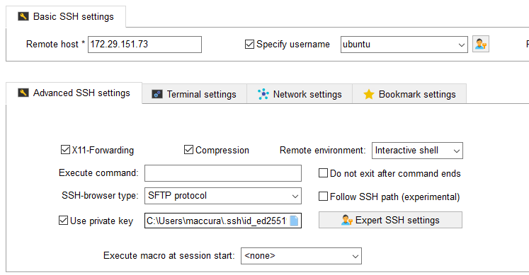
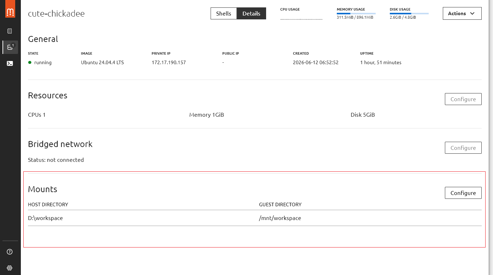
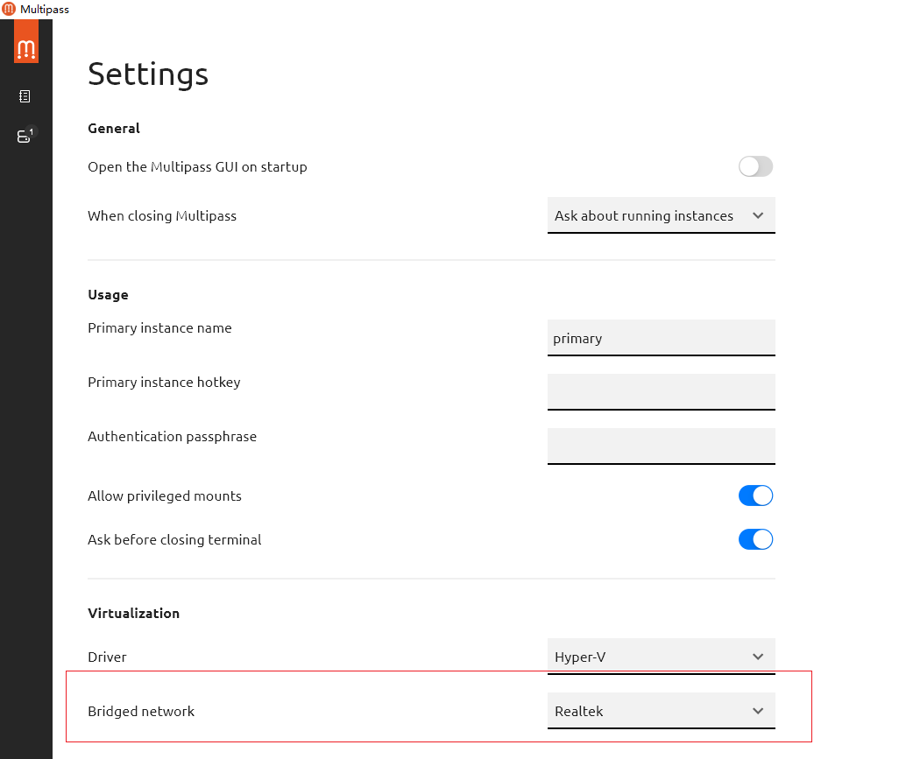

# Multipass使用

## 1. 设置ssh工具远程访问

在外部的powershell中生成key，用于远程访问登录虚拟机。
```powershell
ssh-keygen -t ed25519
```

生成公钥和私钥：
```
id_ed25519.pub # 公钥
id_ed25519     # 私钥
```

拷贝公钥内容复制到虚拟机下的ssh的授权文件中：
```sh
type $env:USERPROFILE\.ssh\id_ed25519.pub | ssh ubuntu@172.29.151.73 "mkdir -p ~/.ssh && cat >> ~/.ssh/authorized_keys"
```

在windows环境可以通过ssh远程：
```powershell
ssh ubuntu@172.29.151.73
```

在MobaXterm中远程连接ubuntu虚拟机，需要手动指定==私钥==：



## 2. 数据交互
宿主机与multipass虚拟机之间交换数据最简单的方式就是挂载目录：

- 开启挂载权限，否则之后执行挂载会失败：
```powershell
multipass set local.privileged-mounts=true
```

- 开启挂载：
```powershell
multipass mount D:\work cute-chickadee:/mnt/work
```

- 查询挂载信息：==Mounts==
```powershell
C:\Users\buerjia>multipass info cute-chickadee
Name:           cute-chickadee
State:          Running
Snapshots:      0
IPv4:           172.17.190.157
Release:        Ubuntu 24.04.4 LTS
Image hash:     53fdde898fee (Ubuntu 24.04 LTS)
CPU(s):         1
Load:           0.73 0.30 0.11
Disk usage:     2.6GiB out of 4.8GiB
Memory usage:   394.7MiB out of 896.1MiB
Mounts:         D:\workspace => /mnt/workspace
                    UID map: -2:default
                    GID map: -2:default
```

或者直接在gui上操作挂载：


## 3. multipass虚拟机设置固定IP
multipass每次虚拟机启动时，IP会发生变化，由DHCP动态分配，造成像`MobaXterm`这类工具不能访问。

**为什么不该改 NAT 网卡的 IP**

Multipass 默认网卡（也就是你看到的 `192.168.x.x`，对应 `eth0`/`default`）走的是 **Hyper-V NAT 交换机**，这个地址段是由 Hyper-V 内部的 DHCP 服务管理的，有几个限制：

- 这个 NAT 网络的网关、DHCP 范围是 Hyper-V 自动维护的，**手动改成静态 IP 容易和 DHCP 池冲突**，或者在 Hyper-V 重启/重建虚拟交换机后网段整体漂移，导致你写死的 IP 失效；
- 这张网卡同时承载 Multipass 守护进程与实例通信的关键流量（`multipass exec`、文件挂载等），改错配置很容易复现你之前"卡 starting"的问题；
- 这也是为什么之前 `dhcp4: false` 直接写在 `default` 接口上会出问题——本质上是在跟 Hyper-V 的 NAT 机制打架；

- 查看网络配置：
```cmd
C:\Users\buerjia>multipass networks
Name             Type       Description
Default Switch   switch     Virtual Switch with internal networking
Realtek          ethernet   Realtek PCIe GbE Family Controller
```

### 3.1 设置Bridge网络：
```cmd
# 查看multipass网络：网络适配器修改成英文名，方便识别
multipass networks

# 设置网桥偏好网络（这一步可以通过GUI设置）
multipass set local.bridged-network=Realtek

# 停止实例
multipass stop myvm

# 绑定网桥
multipass set local.myvm.bridged=true

# 启动（或者从GUI中启动实例）
multipass start myvm
```



### 3.2 设置网桥固定IP
网络配置文件：`/etc/netplan/50-cloud-init.yaml`

设置网桥后的原始配置：
```yaml
network:
  version: 2
  ethernets:
    default:
      match:
        macaddress: "52:54:00:3a:a8:6a"
      dhcp-identifier: "mac"
      dhcp4: true
    extra0:
      match:
        macaddress: "52:54:00:a4:69:08"
      optional: true
      dhcp-identifier: "mac"
      dhcp4: true
      dhcp4-overrides:
        route-metric: 20
```

固定IP后的配置：
```yaml
network:
  version: 2
  ethernets:
    default:
      match:
        macaddress: "52:54:00:3a:a8:6a"
      dhcp-identifier: "mac"
      dhcp4: true
    extra0:
      match:
        macaddress: "52:54:00:a4:69:08"
      optional: true
      dhcp-identifier: "mac"
      dhcp4: false
      addresses:
        - 10.18.39.202/21
      routes:
        - to: default
          via: 10.18.32.1
          metric: 20
      nameservers:
        addresses: [8.8.8.8, 1.1.1.1]
```

注意：
- extra0与实际的 `ip a` 查看获得的eth1是相同的，你也可以把它修改为eth1；
- 网卡配置是通过match下的address匹配的与网卡名无关；
- 固定分配的IP需要确认路由器不会把它分配给其他设备；


- 操作步骤
```sh
# 1. 备份原配置
sudo cp /etc/netplan/50-cloud-init.yaml /etc/netplan/50-cloud-init.yaml.bak

# 2. 编辑配置（替换为上面方法一的内容）
sudo nano /etc/netplan/50-cloud-init.yaml

# 3. 检查语法
sudo netplan generate

# 4. 应用（注意：SSH 连接可能中断，需要用 multipass shell 进入）
sudo netplan apply
```

**注意：** 操作完成之后，==重启multipass服务==。

**固定IP修改错误通过以下方式重置：**
Multipass 在 Windows 上使用 Hyper-V，可以直接用控制台连接，**不依赖网络**：

1. 打开 **Hyper-V 管理器**（搜索 `Hyper-V Manager`）
2. 找到对应的 Multipass 实例
3. 双击 → 打开控制台窗口
4. 直接登录（用户名 `ubuntu`，无密码或密码也是 `ubuntu`）

## 4. 其他
- 删除命令运行时，只是把实例标记为delete，并未真正删除；
```cmd
# 标记删除
multipass delete instance

# 真正删除
multipass purge

# 恢复（被标记删除后）
multipass recover instance
```

