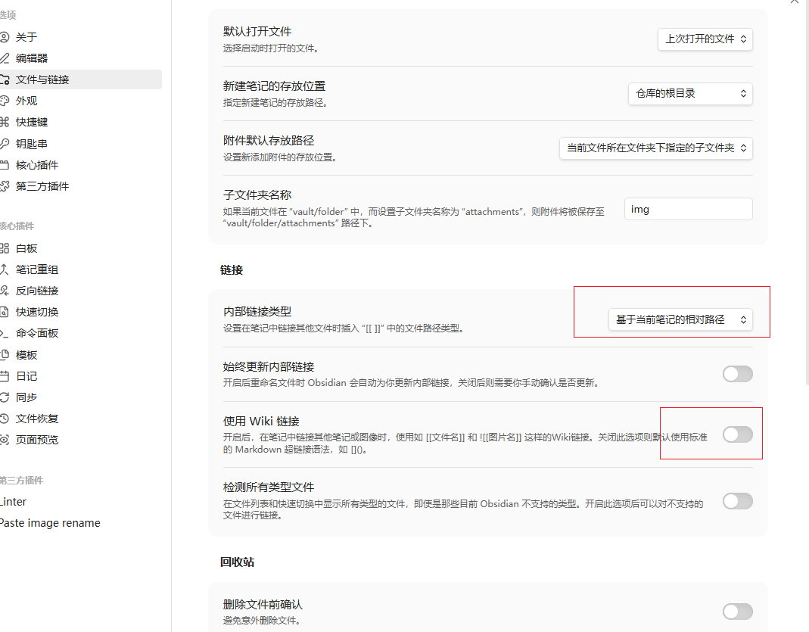
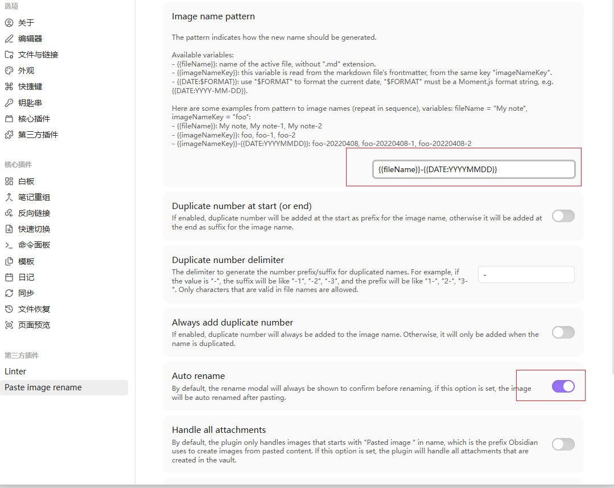

Obisidian+github：作为私人好用的笔记软件。
# 1. 安装
从[官网](https://obsidian.md/)下载软件进行安装即可。
## 2. 使用
### 2.1 修复连接不是标准语法

- 內部链接类型->基于当前笔记的相对路径；
- 关闭wiki链接；
- 一般我们会把当前笔记的文件存在于当前目录的img目录下，所以修改上述设置；
- 从外部粘贴的图片格式不标准，可能包含空格等，在md链接里需要被转移，所以可以安装`Paste Image Rename`插件：
