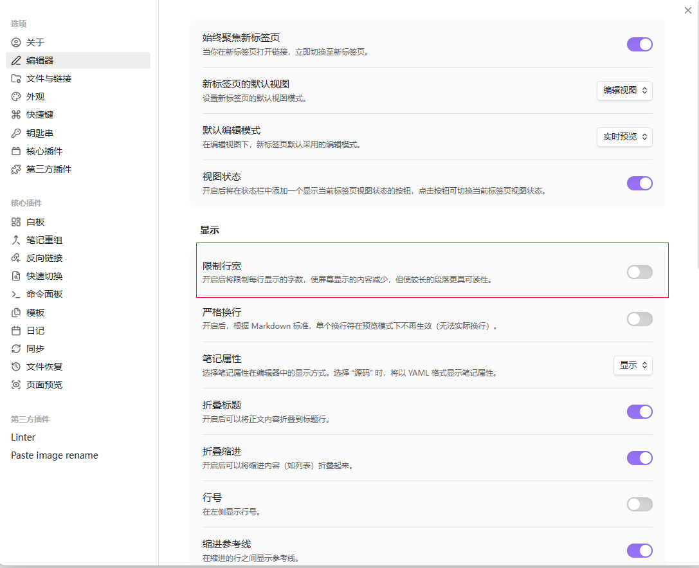
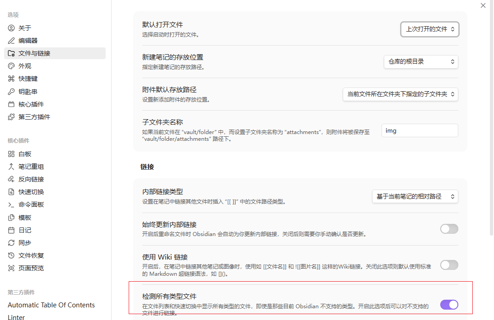
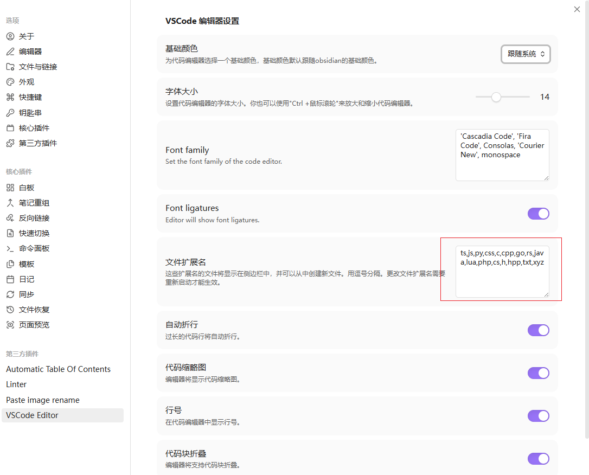
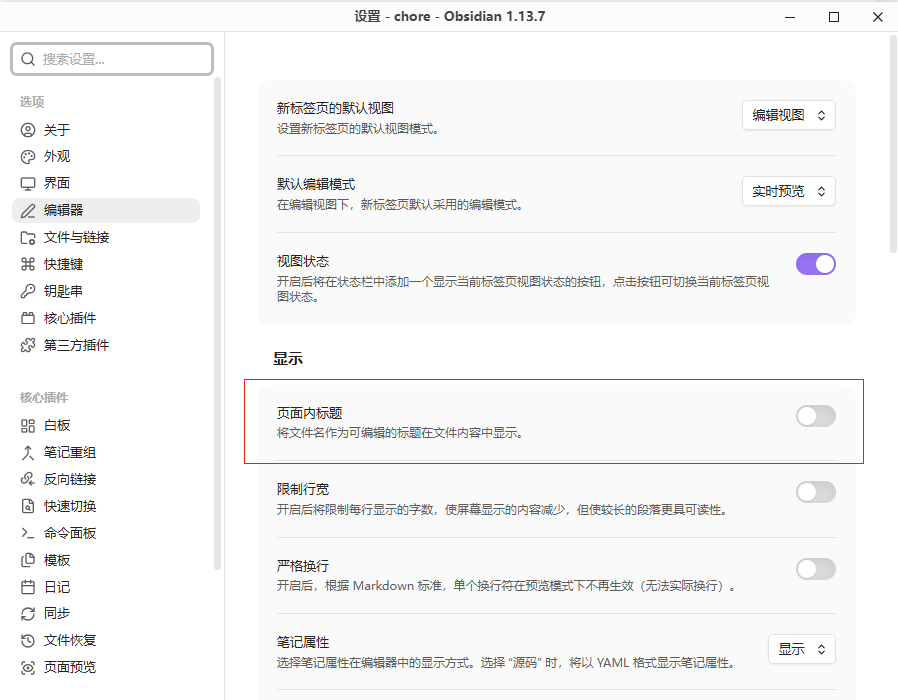

Obisidian+github：作为私人好用的笔记软件。
# 1. 安装
从[官网](https://obsidian.md/)下载软件进行安装即可。
## 2. 使用
### 2.1 修复连接不是标准语法

- 內部链接类型->基于当前笔记的相对路径；
- 关闭wiki链接；
- 一般我们会把当前笔记的文件存在于当前目录的img目录下，所以修改上述设置；
- 从外部粘贴的图片格式不标准，可能包含空格等，在md链接里需要被转移，所以可以安装`Paste Image Rename`插件：

### 2.2 mermaid显示很小的区域
关闭限制行宽可以把mermaid的显示宽度扩大（一般的mermaid图是足够的），如果还是不够宽，则mermaid可以滑动。

### 2.3 obsidian不能查看代码文件问题

首先打开：文件与连接->检测所有类型文件，这样才能在树形结构中显示代码文件。

然后安装 `VSCode Editor` 插件，并且在 `文件扩展名` 新增自定义扩展名。修改后记得需要重启！！！否则扩展名不会生效。

## 2.4 不重复显示标题
关闭 `页面内标题` 选项，否则这个标题只会出现在obsidian中，在其他md工具或者github就不能显示出来。
