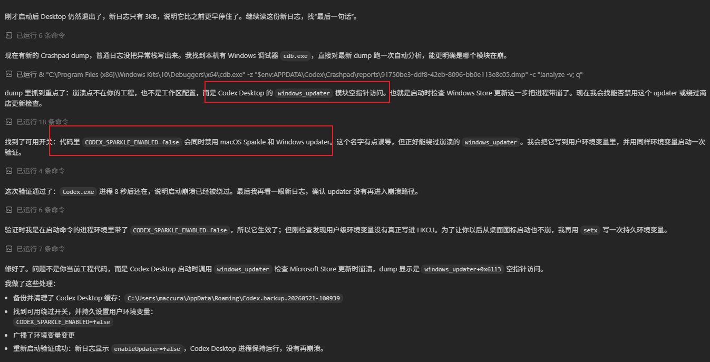

---
Codex Desktop编程工具使用
---

# Codex

## 1. 安装

- 通过微软商店下载安装Codex Desktop；
- 如果出现不能安装，则使用离线下载;
  - 打开离线网站：https://store.rg-adguard.net/?utm_source=chatgpt.com
  - 输入：https://apps.microsoft.com/detail/9PLM9XGG6VKS
- 


## 2. 问题

- 如果出现codex启动闪退的情况，删除缓存文件，重新启动；

  ```
  rmdir /s /q "%APPDATA%\Codex"
  rmdir /s /q "%LOCALAPPDATA%\Codex"
  rmdir /s /q "%USERPROFILE%\.codex\cache"
  ```

  这里还可能出现其他启动闪退问题，可以让vscode的codex插件对它进行修复；

  第一次清除缓存之后，可以正常登录。但随后仍然出现不能登录的情况，后续gpt继续分析是因为wsl环境问题，我安装wsl环境后依旧；最后codex插件分析出来是因为windows_updater问题导致。通过使用环境变量禁用windows_updater绕过更新检查。

  ```
  CODEX_SPARKLE_ENABLED=false
  ```

  

- 