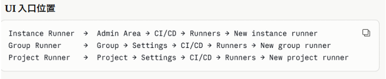
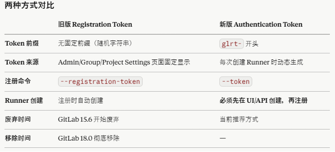
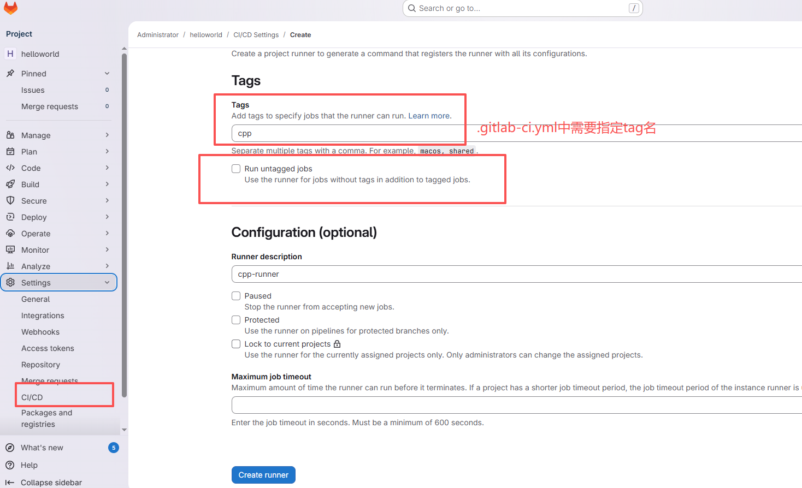
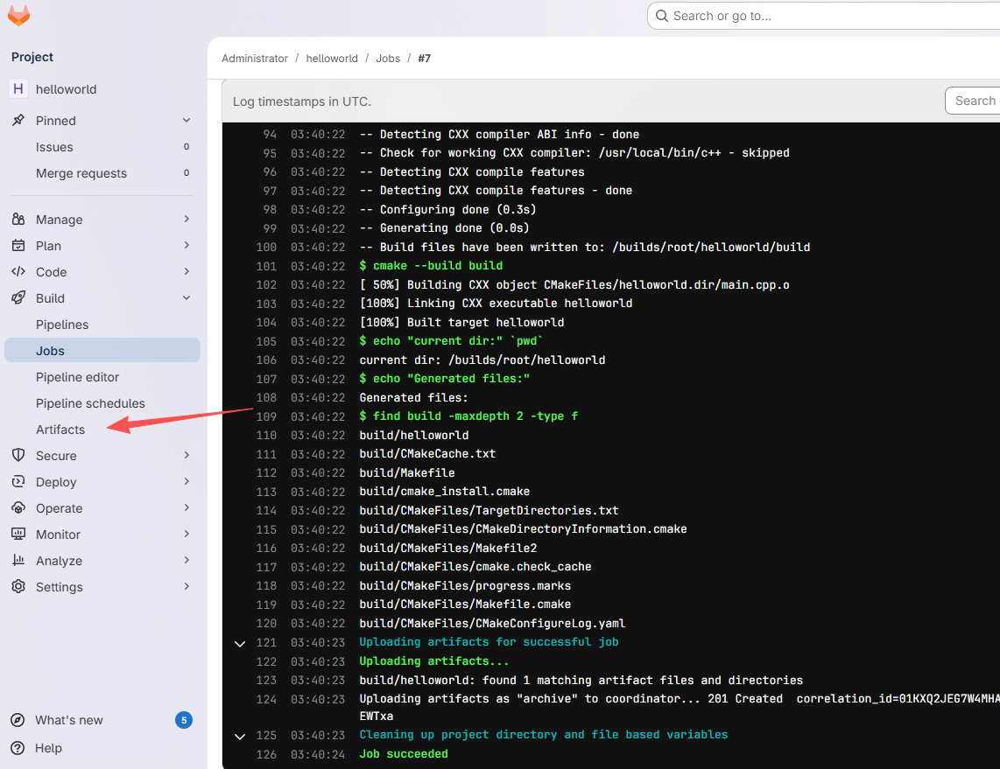

# gitlab

[docker基础](docker基础.md)

## 1. 配置gitlab（docker）

**说明：**
- 这里的docker-compose是完整的gitlab和runner的配置；
- 第一步应该先启动gitlab，弄好gitlab和runner才能使用这份完整的配置；

`docker-compose.yml`
```yml
services:
  gitlab:
    image: gitlab/gitlab-ce:18.9.6-ce.0
    container_name: my-gitlab
    restart: always
    ports:
      - "18080:18080"  # HTTP
      - "18081:22"    # SSH
    environment:
      GITLAB_OMNIBUS_CONFIG: |
        external_url 'http://10.18.92.244:18080'
        nginx['listen_port'] = 18080
        gitlab_rails['gitlab_shell_ssh_port'] = 18081
    volumes:
      - ./gitlab/config:/etc/gitlab
      - ./gitlab/logs:/var/log/gitlab
      - ./gitlab/data:/var/opt/gitlab
    shm_size: '256m'

  runner:
    image: gitlab/gitlab-runner:v18.9.0
    container_name: my-runner
    restart: always
    depends_on:
      - gitlab
    volumes:
      - ./runner/config:/etc/gitlab-runner
      - /var/run/docker.sock:/var/run/docker.sock
```

`external_url` 里写了端口，nginx 必须同步用 `listen_port` 指定，否则会报错。

`/var/run/docker.sock` 指定的是 `gitlab-runner` 这个容器本身能使用宿主机镜像
后续注册也会指定 `/var/run/docker.sock` 代表 yml 中使用的容器能使用宿主机镜像

在当前`docker-compose.yml`文件 <font color="blue">同级目录</font> 运行

```sh
docker compose up
```

gitlab在docker中启动后，可以通过查看容器是否正常启动：

```sh
buerjia@buerjia:~/ws/gitlab$ sudo docker ps -a
CONTAINER ID   IMAGE                          COMMAND                   CREATED         STATUS                   PORTS                                                                                                                                     NAMES
f4883fe5ad26   gitlab/gitlab-ce:18.9.6-ce.0   "/assets/init-contai…"   9 minutes ago   Up 9 minutes (healthy)   80/tcp, 443/tcp, 0.0.0.0:18080->18080/tcp, [::]:18080->18080/tcp, 0.0.0.0:180                            81->22/tcp, [::]:18081->22/tcp   my-gitlab
```

- 观察状态是否为healthy，如果是starting表示正在启动中，需要等待；
- 可以通过 `curl http://10.18.92.244:18080` 测试gitlab是否已经完成启动；
- <font color="red">6000</font> 端口默认是 X11（Linux 图形系统）端口，<font color="red">不要使用</font>；

**查看初始root密码**

- gitlab初始root密码会存于 `/etc/gitlab/initial_root_password` 下；
- 在docker-compose.yml中配置了volumes：`./gitlab/config:/etc/gitlab`；
- 所以可以在这个挂载的config目录下查看initial_root_password密码；

## 2. 注册Runner
### 2.1 Runner说明

Gitlab-Runner容器只做调度，默认镜像兜底 每个 job在yml中配置自己的image，比如后端maven镜像和前端node镜像等 一个Gitlab-Runner容器可以注册多个 Runner，每注册一个就会在 `runners` 属性。




*新版*
- 先在gitlab的UI上创建runner生成token(未连接状态)
- 拿到token后再去服务器上注册runner(正常状态) 

每个runner可指定tag名，然后在gitlab-ci.yml中通过指定tag来决定任务要走哪个runner。
新版只能在UI创建runner的时候就指定tag，不能在服务器上注册的时候指定tag了。



### 2.2 创建Runner




- runner 有一把锁，表示是否只允许当前项目使用该 runner，不能共享
	Runners -> Edit -> Lock to current projects 取消选中 ->Save changes
	
- runner 一直 <font color="red"> pending</font>，表示是否允许跑 “没有 tag 的 job”
	如果 `.gitlab-ci.yml` 里没写 tags，而 Runner 指定了 `tags,Runner` 默认会“嫌弃”这个任务，不去执行它
	Runners -> Edit -> Run untagged jobs 选中->Save changes
	
- runner 会去拉镜像
	修改 config.toml，让它使用宿主机本地已有的镜像

### 2.3 注册Runner

- 交互模型注册

```sh
docker run --rm -it \
  -v $(pwd)/runner/config:/etc/gitlab-runner \
  gitlab/gitlab-runner:v18.9.0 register
```

依次输入：
```
GitLab URL:
http://10.18.92.244:18080

Runner token:
glrt-xxxxxxxxxx

Executor:
docker

Default image:
gcc:latest
```


- 非交互模式注册

> runner 镜像未运行：
```sh
sudo docker run --rm -it \
    -v $(pwd)/runner/config:/etc/gitlab-runner \
    -v /var/run/docker.sock:/var/run/docker.sock \
    gitlab/gitlab-runner:v18.9.0 register \
    --non-interactive \
    --url "http://192.168.182.132:18080" \
    --token "glrt-pGnvVHGqFLj15xilzR9W3W86MQpwOjEKdDozCnU6MQ8.01.1714j6a2s" \
    --executor "docker" \
    --name "my-name" \
    --docker-image "alpine:latest" \
    --docker-pull-policy "if-not-present" \
    --docker-helper-image "gitlab/gitlab-runner-helper:x86_64-v18.9.0" \
    --docker-privileged \
    --docker-volumes "/var/run/docker.sock:/var/run/docker.sock"
```

> runner 镜像已运行：
```sh
sudo docker exec -it my-runner gitlab-runner register \
    --non-interactive \
    --url "http://192.168.182.132:18080" \
    --token "glrt-xxxxx" \
    --executor "docker" \
    --name "my-name" \
    --docker-image "alpine:latest" \
    --docker-pull-policy "if-not-present" \
    --docker-helper-image "gitlab/gitlab-runner-helper:x86_64-v18.9.0" \
    --docker-privileged \
    --docker-volumes "/var/run/docker.sock:/var/run/docker.sock"
```

--docker-image 默认镜像。
当 `.gitlab-ci.yml` 没指定镜像时使用。

注册完毕后，会写入 `config.toml` 文件：

```toml
buerjia@buerjia:~/ws$ sudo cat runner/config/config.toml
concurrent = 1
check_interval = 0
shutdown_timeout = 0

[session_server]
  session_timeout = 1800

[[runners]]
  name = "my-name"
  url = "http://192.168.182.132:18080"
  id = 1
  token = "glrt-pGnvVHGqFLj15xilzR9W3W86MQpwOjEKdDozCnU6MQ8.01.1714j6a2s"
  token_obtained_at = 2026-07-16T09:44:54Z
  token_expires_at = 0001-01-01T00:00:00Z
  executor = "docker"
  [runners.cache]
    MaxUploadedArchiveSize = 0
    [runners.cache.s3]
    [runners.cache.gcs]
    [runners.cache.azure]
  [runners.docker]
    tls_verify = false
    image = "alpine:latest"
    privileged = true
    disable_entrypoint_overwrite = false
    oom_kill_disable = false
    disable_cache = false
    volumes = ["/var/run/docker.sock:/var/run/docker.sock", "/cache"]
    pull_policy = ["if-not-present"]
    shm_size = 0
    helper_image = "gitlab/gitlab-runner-helper:x86_64-v18.9.0"
    network_mtu = 0
```

```sh
docker exec -it my-runner gitlab-runner --help
docker exec -it my-runner gitlab-runner register --help
docker exec -it my-runner gitlab-runner list
docker exec -it my-runner gitlab-runner unregister --name "my-runner-1"
```

### 2.4 Runner失败常见原因总结

|现象|原因|解决方法|
|---|---|---|
|没有 Pipeline|`.gitlab-ci.yml` 不存在或未触发|检查 CI 文件和触发规则|
|Pending|Runner 未关联项目|在项目中启用 Runner|
|Pending|Tag 不匹配|修改 `tags` 或启用 `Run untagged jobs`|
|Pending|Runner Offline|启动 Runner 容器|
|Pending|Runner Locked|解锁或重新注册 Runner|
|Pending|Runner 被 Pause|恢复 Runner|
## 3. Hello完整示例流程

准备工作：已经完成 `gitlab 和 runner` 配置。

cpp工程准备：

```
.gitlab-ci.yml
CMakeLists.txt
main.cpp
```

`main.cpp`
```cpp
#include <iostream>

int main()
{
    std::cout << "Hello GitLab CI!!" << std::endl;
    return 0;
}
```

`CMakeLists.txt`
```cmake
cmake_minimum_required(VERSION 3.10)
project(hello LANGUAGES CXX)

set(CMAKE_CXX_STANDARD 11)
set(CMAKE_CXX_STANDARD_REQUIRED ON)

add_executable(hello main.cpp)
```

`.gitlab-ci.yml`
```yml
image: gcc:latest

stages:
  - build

before_script:
  - apt-get update
  - apt-get install -y cmake

build:
  stage: build

  script:
    - cmake -B build .
    - cmake --build build
	# 调试，打印当前工作目录
    - echo "current dir:" `pwd`
    - echo "Generated files:"
    - find build -maxdepth 2 -type f


  artifacts:
    paths:
      - build/hello

    expire_in: 7 days
```

在 gitlab 创建 hello 工程，把这个项目推送上去即可启动 pipeline。

流水线执行成功后，会把 artifacts 上传到 gitlab页面。



你应该也观察到了，每次docker启动runner镜像时，都会执行我们在gitlab-ci中定义的命令：`apt update & apt install cmake`，效率较低。

使用docker build构建特有镜像解决该问题，参考：[docker基础：8. docker build](docker基础.md)
