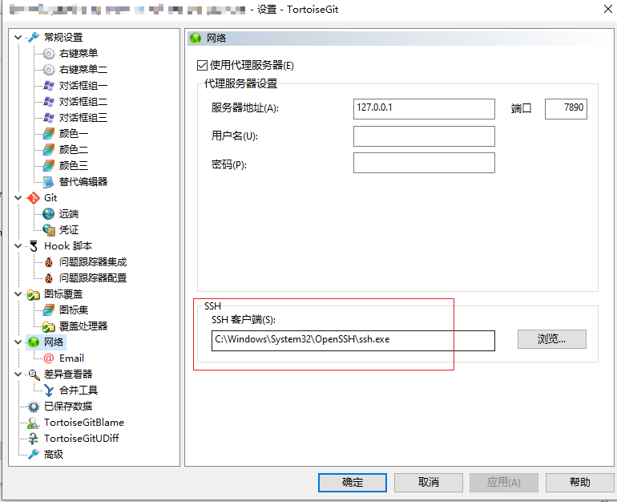
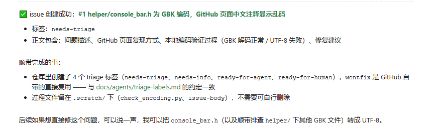
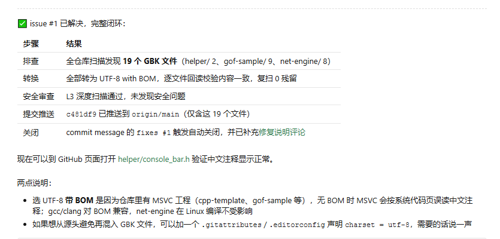
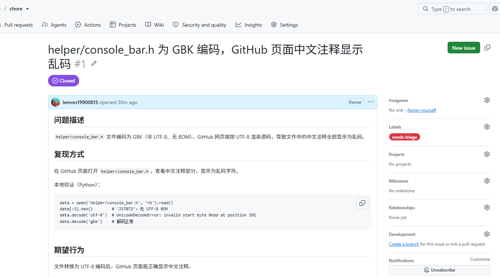
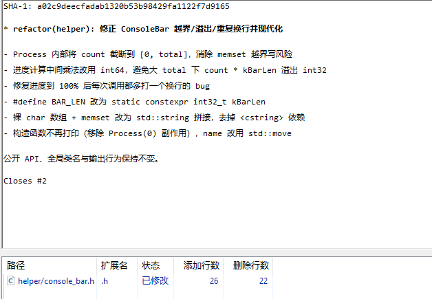
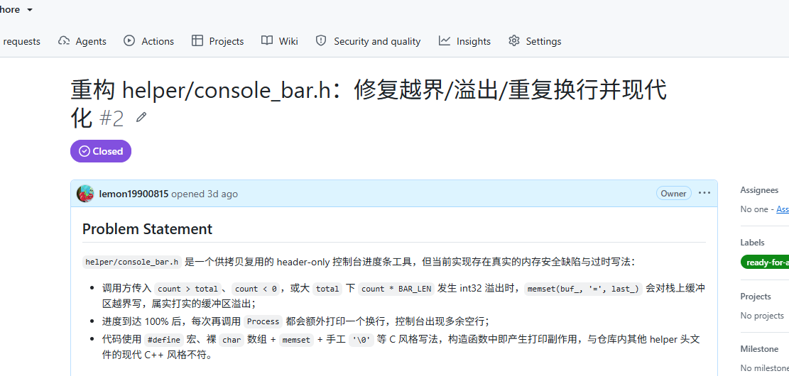

# git知识点

- content
  - [1. git修改默认编辑器](#1. git修改默认编辑器)
  - [2. git submodule](#2. git submodule)
  - [3. git rebase](#3. git rebase)
  - [4. git log](#4. git log)
  - [5. git remote](#5. git remote)
  - [6. git stash](#6. git stash)
  - [7. git branch](#7. git branch)


## 1. git editor

```sh
# git默认使用的时nano编辑器
# 修改为默认vim编辑
vim ~/.gitconfig

# 在文件中增加以下内容
[core]
	editor = vim
```

## 2. git submodule

```shell
# 同步子模块
$ git submodule init
$ git submodule sync
$ git submodule update

# 工程中添加子模块
$ cd submodule
$ git submodule add -b <branch-name> <repo-url> <path>

# e.g.
$ git submodule add [-b dev] http://url/zlib.git [zlib]

# 操作完成后，可以看到submodule下已经添加了子模块以及.gitmodules(上一级目录下)

# 下载仓库和依赖的子模块
$ git clone repo --recursive
```

您可以使用git中的子模块来执行此操作。在您的存储库中，执行以下操作：

```sh
$ git submodule add path_to_repo path_where_you_want_it
```

因此，如果库的存储库的URL为，`git://github.com/example/some_lib.git`而您想`lib/some_lib`在项目中使用它，则应输入：

```sh
$ git submodule add git://github.com/example/some_lib.git lib/some_lib
```

请注意，这需要从存储库的顶级目录中完成。因此，不要`cd`进入将其放在第一位的目录中。

添加子模块后，或者每当有人对存储库进行新签出时，您需要执行以下操作：

```sh
$ git submodule init
$ git submodule update
```

然后，您添加的所有子模块都将以您拥有的相同版本签出。

当您要更新其中一个库的较新版本时，请`cd`进入子模块并拉出：

```sh
$ cd lib/some_lib
$ git pull
```

然后，当您执行a时`git status`，应该会看到`lib/somelib`修改部分中列出的内容。添加该文件，提交，您就是最新的。当协作者将该提交提交到他们的存储库中时，他们将被`lib/somelib`视为已修改，直到`git submodule update`再次运行。

**初始化&更新子模块：**

```sh
$ git submodule update --init --recursive --remote
```

- `--init`：这个选项会初始化子模块，即如果子模块尚未被克隆到本地，它会自动克隆这些子模块。
- `--recursive`：这个选项会递归地更新所有嵌套的子模块。如果你的子模块中还有其他子模块，使用这个选项可以确保所有层级的子模块都得到更新。
- `--remote`：这个选项使得 Git 从子模块的远程仓库获取更新，而不是使用当前 `HEAD` 所指向的提交。具体来说，它将更新每个子模块到其配置的远程跟踪分支的最新提交，例如 `master` 或 `main`。

## 3. git rebase

reference： [参考连接](https://blog.csdn.net/qq_39253370/article/details/124277214?d=1676020974837)

git变基操作（合并多个commit），也可以指定合并某个版本之前的版本：git rebase -i 3a4226b 但不包含 3a4226b，至合并他之前的。执行了 rebase 之后会弹出一个窗口，让你选择合并哪些 commit 记录。

```sh
$ git rebase -i HEAD~4
```

需要把 pick 改为 s 或 squash，需要留第一个，第一个不要改，意思是下面的 commit 记录都合并到第一个上面去。

```sh
pick 3ca6ec3   '注释**********'   => pick 3ca6ec3   '注释**********'
pick 1b40566   '注释*********'    => s 1b40566      '注释*********'
pick 53f244a   '注释**********'   => s 1b40566      '注释*********'
```

如果有冲突，可以先解决冲突，解决完之后执行：

```sh
$ git add .
$ git rebase --continue
```

如果不想执行或者想放弃的话可以执行：

```sh
$ git rebase --abort
```

如果没有冲突，或者冲突已经解决，会弹出窗口，让你注释掉一些提交记录，这里是让我们编辑自己合并的这些记录的概览，如：完成了什么功能，按照实际情况填写。

```sh
 This is a combination of 4 commits.  
# 写上合并的这些 commit 做了什么事，如：
完成了 api 的编写：
	1. 完成了用户相关的 api 编写
	2. 完成了用户列表相关 api 编写

# 下面的都注释
# The first commit’s message is:  
# 注释......
# The 2nd commit’s message is:  
# 注释......
# The 3rd commit’s message is:  
# 注释......
# Please enter the commit message for your changes. Lines starting # with ‘#’ will be ignored, and an empty message aborts the commit.
```

**重要**：变基之后不能直接使用git pull操作，要使用git pull --rebase，否则变基之前的多个commit将再次出现。

合并之后由于 commit 记录发生了变基，需要使用 -f 关键字提交，由于我们都是在自己分支开发，不会覆盖其他人提交的记录，如果在主分支请谨慎使用 -f 提交，因为会覆盖别人的代码。

## 4. git log

```shell
# 一行日志：--pretty=oneline
$ git log --pretty=oneline

# 简短hash：--abbrev-commit
$ git log --abbrev-commit

# 一行子日志简短的hash
$ git log --pretty=oneline --abbrev-commit
$ git log --oneline
```

## 5. git remote

```sh
# 显示git远端地址（显示本地和远程的所有仓库）
$ git remote -v

# fork远程仓库到自己的本地仓库中
remote_git
user_git: fork from remote_git

# 克隆本地仓库
$ git clone @user_git

# 添加远程仓库
$ git remote add upstream @remote_git

# 这时git remote -v可以看到有2个仓库信息

# 从remote仓库拉取更新
$ git pull upstream master

# 从user仓库拉取更新
$ git pull origin master

# 推送提交到user仓库
# git add * & git commit -m "this is a test commit."
$ git push origin master

# git仓库发生迁移
# 1.删除本地对应的fork仓库
$ git remote remove/rm orgin <url>
# 2.添加新的地址仓库
$ git remote add orgin <url>
# 3.直接更换repository
$ git remote set-url origin <url>
```

## 6. git stash

拉取远程仓库时，由于本地存在修改可能拉取会失败，通常的做法是把本地修改提交到暂存区，待远程仓拉取完成后，再从暂存区把本地修改恢复出来。

```sh
# 提交到暂存区
$ git stash

# 从暂存区恢复
$ git stash pop [stash@{n}]

# 查看暂存区列表
$ git stash list
stash@{0}: WIP on dev: 1316032 message1
stash@{1}: WIP on malab: 11e9ca1 test1
stash@{2}: WIP on malab: e987bab test2
stash@{3}: WIP on malab: 59ed354 test3

# 删除最新的 stash 条目
$ git stash drop

# 删除指定的stash条目
$ git stash drop stash@{n}

# 清空所有 stash 条目
$ git stash clear
```

## 7. git branch

```sh
# 查看分支列表
$ git branch

# 新建分支
$ git branch branch_name

# 删除分支，如果有未合并的提交会失败，
# 如果确认不需要，则可使用参数-D强制删除
$ git branch -d branch_name

# 删除远程分支
$ git push origin --delete branch_name

# 切换分支
$ git checkout branch_name

# 新建分支并切换到对应分支
$ git checkout -b branch_name
```

## 8. TortoiseGit设置ssh密钥

生成ssh密钥：

```sh
ssh-keygen -t rsa -b 4096 -C "user@github.com"
```

密钥信息会生成到home下：
Windows：`C:\Users\buerjia\.ssh`
Linux：`~/.ssh/`

```
# 私钥
id_rsa
# 公钥
id_rsa.pub
```

把生成的 **公钥** 内容添加到gitlab的SSH Keys管理页面。
`TortoiseGit`->设置/网络 修改为：`C:\Windows\System32\OpenSSH\ssh.exe`


## 9. git restore

git status显示本地存在修改，想要还原时，使用 `git restore`

```bash
# 显示本地修改纪录
$ git status

# 还原本地所有修改，也可指定还原某个文件
$ git restore .
```

本地普通修改：
```bash
普通本地修改
    ↓
git restore .
    ↓
恢复到 HEAD
```

合并修改：
```bash
git merge dev
    ↓
产生 merge commit
    ↓
HEAD 已经包含 dev 的代码
    ↓
git restore . 无法撤销 merge
```

如果你只是**刚刚执行了 merge，现在后悔了**：
```bash
git reset --hard ORIG_HEAD
```

如果**merge 还处于冲突状态**：
```bash
git merge --abort
```

对于添加的文件，想要从stage中移除：
```bash
git add <文件>
git restore --staged <文件>
```

如果本地因为 `某些原因(通常是拉取中途失败，本地已存在某些文件)` 导致拉取远端代码出现以下错误：
```
error: The following untracked working tree files would be overwritten by merge:
```

这时可以通过硬重置和远端对齐的方式处理该问题（需确认本地没有修改）：
```bash
git reset --hard origin/dev
```
如果本地 `untracked files` 是自己不需要的，还可以使用 `git clean` 清除。

**注意：** 通常当前工程下还存在一些未提交的文件，需要慎重使用 `git clean`。

## 10. git clean

git clean清理未跟踪的文件，并且删除后不会进入回收站，需要**慎用**。

```sh
# 查看哪些文件会被clean删除掉
git clean -fdn

# 执行删除动作
git clean -fd
```

## 11. Conventional Commits

标准格式：

```
<type>(可选scope): <description>
```

例如：

```
feat(login): 支持微信登录
fix(api): 修复用户信息为空的问题
docs: 更新 README
```

| type     | 含义                       |
| -------- | -------------------------- |
| feat     | 新功能                     |
| fix      | 修复 bug                   |
| docs     | 文档修改                   |
| style    | 代码格式调整（不影响逻辑） |
| refactor | 重构                       |
| perf     | 性能优化                   |
| test     | 测试相关                   |
| build    | 构建系统修改               |
| ci       | CI/CD 修改                 |
| chore    | 杂项、维护                 |
| revert   | 回滚提交                   |

很多公司会要求：

```
feat:
fix:
refactor:
docs:
```

必须小写。

description 一般：

- 使用中文或英文
- 不要首字母大写
- 不加句号

例如：

✅：

```
fix(cache): 修复缓存失效问题
```

❌：

```
Fix Cache Bug.
```

最佳实践：

```
feat(module): 新增xxx功能
fix(module): 修复xxx问题
refactor(module): 重构xxx逻辑
docs: 更新文档
chore: 更新依赖

# 不兼容升级
feat(api)!: 修改用户接口返回结构
```

好处：

1. 方便日志信息检索；
2. 方便自动化工具生成CHANGELOG；

## 12. git push

```bash
# -u: --set-upstream
git push -u origin feature/test
```

如果远端 `origin` 上不存在 `feature/test` 分支，Git 会自动创建。
如果已经存在，则直接推送更新。

**当前分支直接推送（最常用）**

如果你已经切换到目标分支：

```
git push -u origin HEAD
```

或者：

```
git push -u origin $(git branch --show-current)
```

这样不需要手动写分支名。

## 13. git fetch

对于小型而言，在原来的仓库中直接新建自己的开发分支是更简单的方式。

在本地自己分支开发时，别人开发完之后合并到一个dev的主分支，本地个人开发分支需要拉取dev，然后合并到个人的开发分支。

```sh
# 只拉取 dev,如果不指定dev，会拉取所有的分支
git fetch origin dev

# 在 个人开发分支 上变基（或者项目有merge要求的，使用merge）
git rebase/merge origin/dev
```

## 14. git switch

切换分支命令：主要为了把切换分支从 `git checkout` 命令独立出来。

切换分支：`git checkout test`，但 `git checkout file.cpp` 表示恢复文件。

所以 Git 后来拆成：

```sh
git switch   # 分支相关
git restore  # 文件恢复相关
```

创建并切换到新分支（如果没有指定origin/main则使用当前分支为基）

```sh
git switch -c new_branch origin/main
```

## 15. git lfs

[Git LFS（Large File Storage）](https://git-lfs.com/)是 Git 的扩展，用来管理大文件（模型、安装包、图片、视频、DLL、ZIP 等），避免把大文件直接塞进 Git 对象库导致：

- clone/pull/push 很慢
- 仓库体积暴涨
- GitHub 推送超时（你现在遇到的情况就可能相关）
- 历史记录中重复保存大文件

### 15.1 跟踪大文件

例如项目中有：

```
install.rar
release.zip
model.bin
```

配置：

```bash
git lfs track "*.rar"
git lfs track "*.zip"
git lfs track "*.bin"
```

会生成：

```
.gitattributes
```

内容类似：

```
*.rar filter=lfs diff=lfs merge=lfs -text
*.zip filter=lfs diff=lfs merge=lfs -text
*.bin filter=lfs diff=lfs merge=lfs -text
```

提交：

```bash
git add .gitattributes
git commit -m "Add LFS tracking"
```

### 15.2 添加文件
例如：

```bash
git add release.zip
git commit -m "Add release package"git push
```

实际上 Git 中保存的是：

```
version https://git-lfs.github.com/spec/v1
oid sha256:...
size 123456789
```

真正文件上传到 Git LFS 存储区。

### 15.3 查看LFS文件
查看当前跟踪规则：

```bash
git lfs track
```

查看仓库中的 LFS 对象：

```bash
git lfs ls-files
```

例如：

```
abc123 * release.zip
def456 * install.rar
```

### 15.4 拉取LFS文件
克隆：

```bash
git clone <repo>
```

自动下载 LFS 文件。

如果只拉到了指针文件：

```bash
git lfs pull
```

或者：

```bash
git lfs fetch
git lfs checkout
```
### 15.5. 跳过 LFS 下载

有时仓库太大：

```bash
set GIT_LFS_SKIP_SMUDGE=1
git clone <repo>
```

之前你就用过这个方法。

之后需要时：

```bash
git lfs pull
```

再下载真正文件。

### 15.6 查看LFS占用
查看：

```bash
git lfs ls-files
```

以及：

```bash
git count-objects -vH
```

如果大文件都在 LFS 中：

```
size-pack
```

通常会很小。

### 15.7 已提交大文件怎么办？

很多人踩这个坑：

**错误做法**

先提交：

```bash
git add install.rargit commit
```

后来再：

```bash
git lfs track "*.rar"
```

这样没用。

因为：

```
install.rar
```

已经进入 Git 历史。

---

**正确迁移**

例如：

```bash
git lfs migrate import --include="*.rar"
```

或者：

```bash
git lfs migrate import --include="*.zip,*.rar,*.7z"
```

会重写历史，把历史中的大文件变成 LFS。

然后：

```bash
git push --force
```

## 16. gitlab squash commit

当从个人开发分支audit新增多个提交（A1，A2，A3）到远端gitlab时，发起MR，选择squash commit后，在目标开发分支dev上就会把多个提交合并成一个S1，这时本地的分支audit如果想要rebase或者merge这个远端分支dev时，通常会存在很多冲突。虽然他们本身是一致的，但是本地的audit分支仍然不能正常rebase或者merge，造成很多困难。

这其实是 **Squash Merge 工作流最大的缺点**，也是很多团队后来放弃长期使用 Squash Merge 的原因。

```
第一次：

audit
A1
A2
A3
A4
A5

        MR (Squash)

BS_20260930

S1（=A1+A2+A3+A4+A5）
```
之后你继续开发：
```
audit

A1
A2
A3
A4
A5
A6
A7
```
然后再次发 MR 到 `BS_20260930`。

GitLab 会比较：
```
audit:
A1 A2 A3 A4 A5 A6 A7

BS_20260930:
S1
```
对于 Git 来说：

- `A1~A5` **不存在于** `BS_20260930`（因为只有 `S1`）
- `S1` **不存在于** `audit`

它们的**共同祖先**还是第一次分支出来的位置。

于是 Git 会尝试：

```
重新把 A1
重新把 A2
重新把 A3
重新把 A4
重新把 A5
再加 A6
再加 A7
```

**这不是你的操作问题，而是 Squash Merge 的历史造成的**

很多人误以为：

> "第一次 Squash Merge 后，以后只会比较新增的 A6、A7。"

实际上不会。

Git 比较的是 **Commit DAG（提交图）**，不是代码内容。

Squash 以后：

```
A1 A2 A3 A4 A5
```

和

```
S1
```

已经没有对应关系了。

由于 `S1` 已经修改了同样的代码，就很容易出现大量冲突，MR 也无法自动合并。

**推荐的几种解决方案**

- 方案一（最推荐）：每次 Squash Merge 后重建开发分支
> 这是 GitLab 官方也推荐的做法。

- 方案二：不要使用 Squash Merge（长期最佳）
> 长期维护 `audit` 分支。

- 方案三：每次新建功能分支
> 不要长期维护一个 `audit`。

## 17. 本地修改不纳入git跟踪

如果本地使用的git受控文件需要与git远程仓库的不一致，并且该文件可能处于长期不修改状态。可以使用以下方式对它进行调整，这样就可以避免每次切换分支或者拉取更新时，提示本地有修改未提交。

让git忽略/不跟踪文件的本地修改：
```bash
git update-index --skip-worktree src/.clangd
```
如果出现对文件进行了修改，则需要使用以下方式进行恢复：
```bash
git update-index --no-skip-worktree src/.clangd
```
恢复之后把当前文件暂存/重置：
```bash
# 暂存
git stash/git stash pop
# 重置
git checkout -- src/.clangd
```

## 18. gh 命令行用法

登录（设置代理再登录）：
```powershell
$env:HTTPS_PROXY = "http://127.0.0.1:7890"
$env:HTTP_PROXY = "http://127.0.0.1:7890"
gh auth login
```

cmd下设置到一起：
```cmd
set HTTP_PROXY=http://127.0.0.1:7890
set HTTPS_PROXY=http://127.0.0.1:7890
set ALL_PROXY=socks5://127.0.0.1:7890

# 或者
set "HTTP_PROXY=http://127.0.0.1:7890"
```

交互展示：
```powershell
PS C:\Users\buerjia\Desktop> gh auth login
? Where do you use GitHub? GitHub.com
? What is your preferred protocol for Git operations on this host? SSH
? Upload your SSH public key to your GitHub account? C:\Users\buerjia\.ssh\id_rsa.pub
? Title for your SSH key: (GitHub CLI)

? Title for your SSH key: GitHub CLI
? How would you like to authenticate GitHub CLI? Login with a web browser

! First copy your one-time code: xxxx-xxxx
Press Enter to open https://github.com/login/device in your browser...
✓ Authentication complete.
- gh config set -h github.com git_protocol ssh
✓ Configured git protocol
✓ SSH key already existed on your GitHub account: C:\Users\maccura\.ssh\id_rsa.pub
✓ Logged in as lemon19900815
```

创建issue：`helper/console_bar.h不是utf8格式的在github页面不能正确显示中文注释`

修复issue：

修复完成后会推送更新，并关闭issue。

github-issue页面展示：


总结：可以利用github的issue做方案、问题跟踪等。

commit message携带 Closes 标签，推送到主分支时，会关闭关联的issue：


github关闭issue：


## 19. git status

`-C`：在执行 Git 命令之前，先切换到指定目录
```bash
git -C d:\workspace\components status --porcelain
```

等价于：
```bash
cd d:\workspace\components
git status
```

好处是：
- 不需要改变当前命令行目录
- 脚本中非常常用
- 可以同时操作多个仓库

`--porcelain`：输出稳定格式，方便脚本解析。