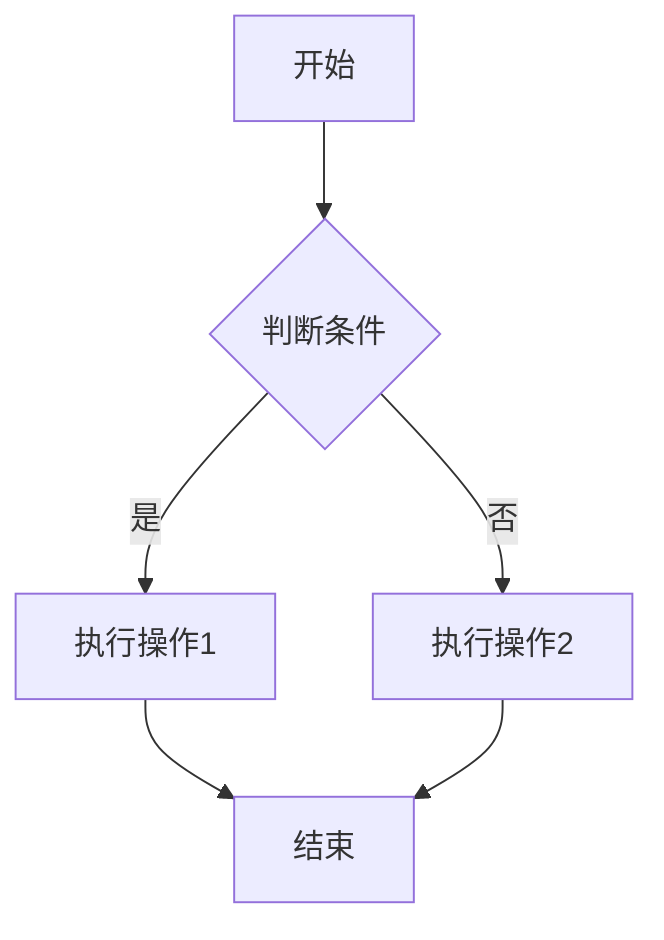
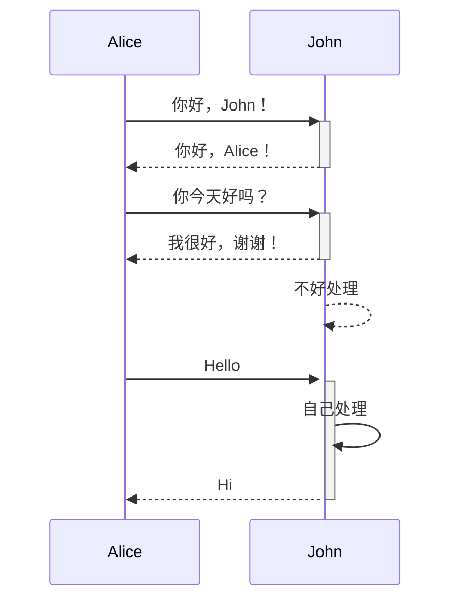
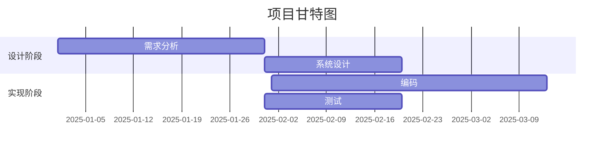
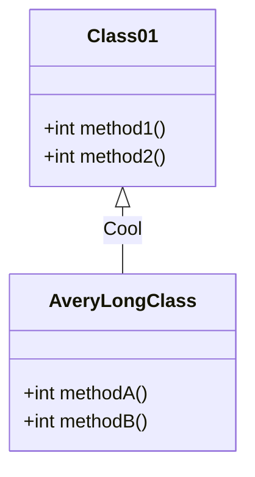
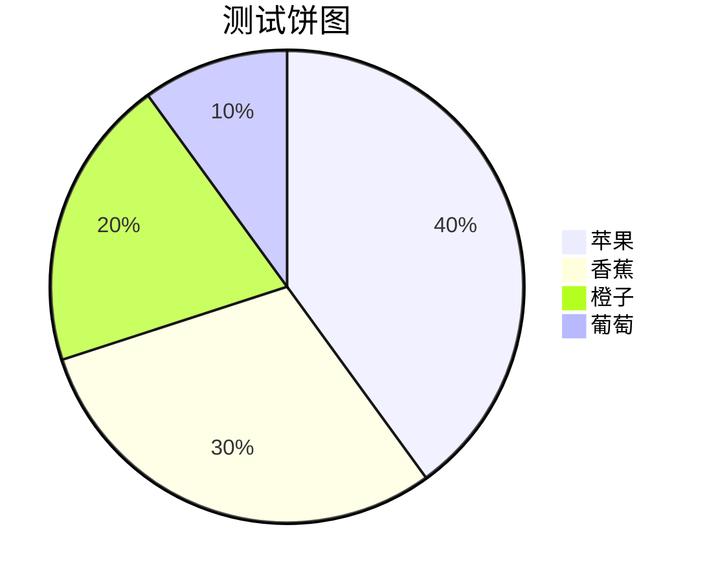
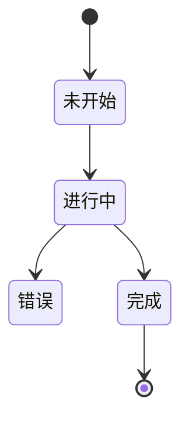
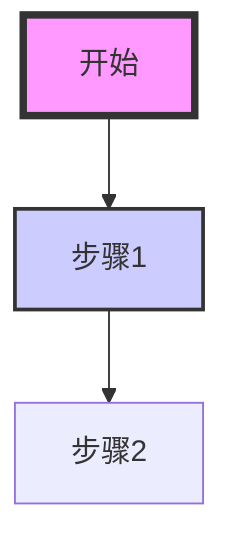

当然！以下是每种类型图表的完整 Mermaid 脚本，您可以直接使用这些脚本在支持 Mermaid 的环境中生成相应的图表。

### 1. 流程图 (Flowchart)

### 2. 序列图 (Sequence Diagram)

### 3. 甘特图 (Gantt Chart)

### 4. 类图 (Class Diagram)

### 5. 饼图 (Pie Chart)

### 6. 状态图 (State Diagram)

### 7. 自定义样式的流程图

### 使用说明

您可以将这些 Mermaid 脚本复制到支持 Mermaid 的 Markdown 编辑器或在线 Mermaid 编辑器中（如 [Mermaid Live Editor](https://mermaid-js.github.io/mermaid-live-editor/)）进行可视化。只需将脚本粘贴到编辑器中，然后渲染即可查看相应的图表。