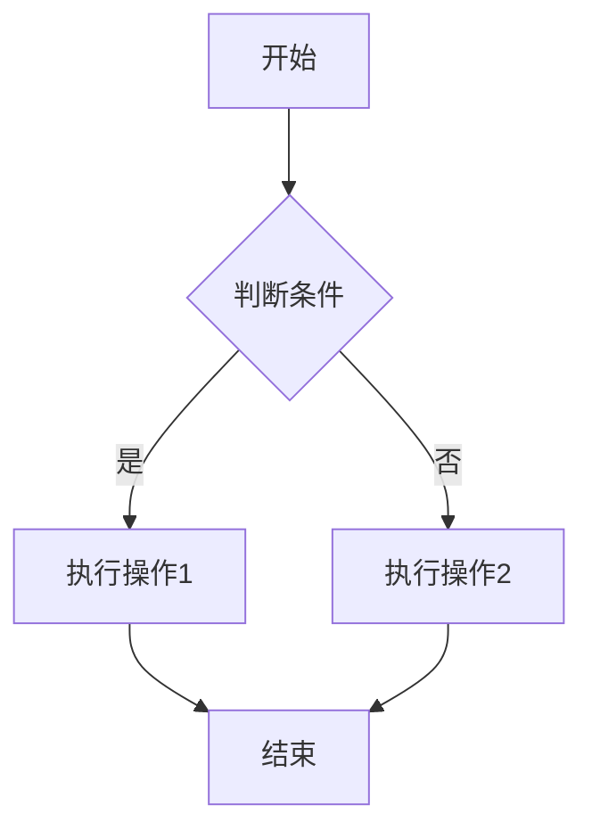
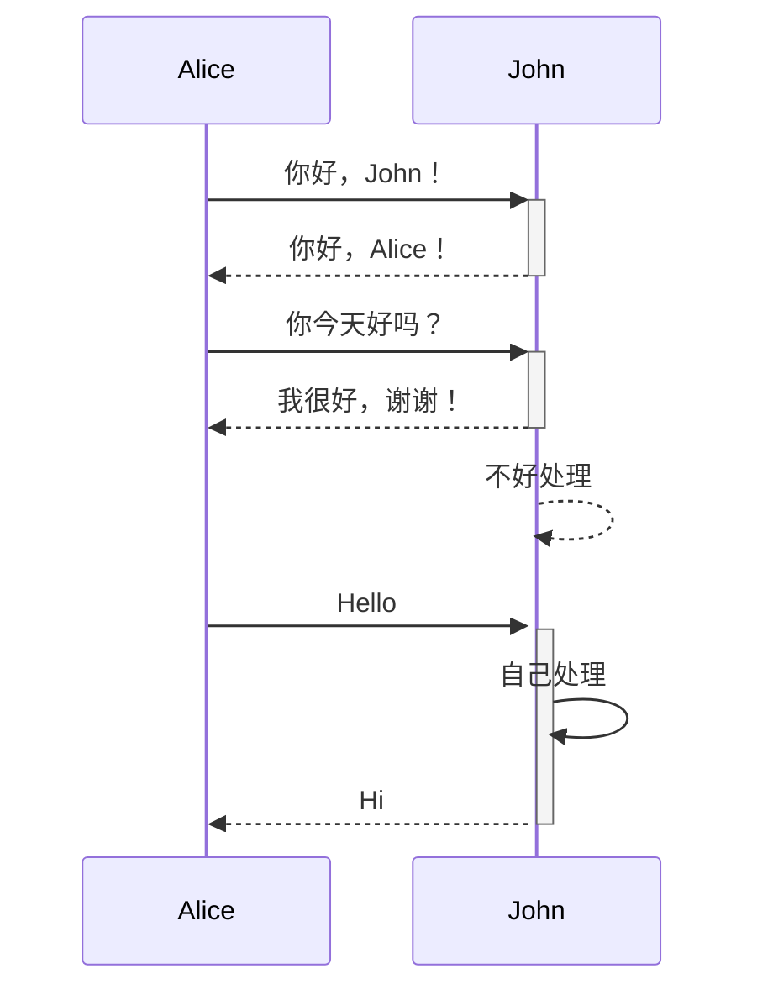
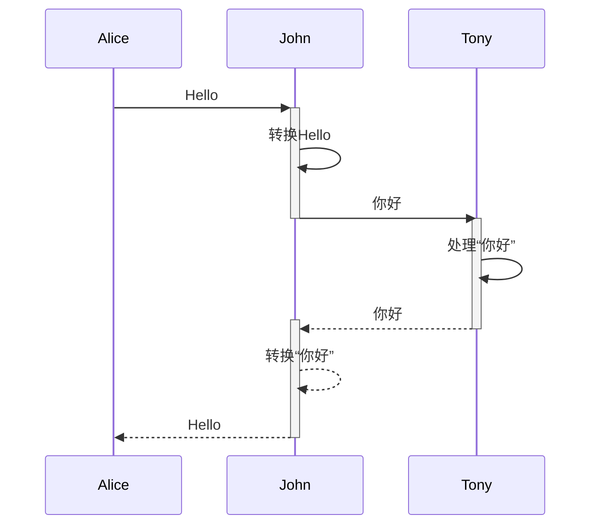
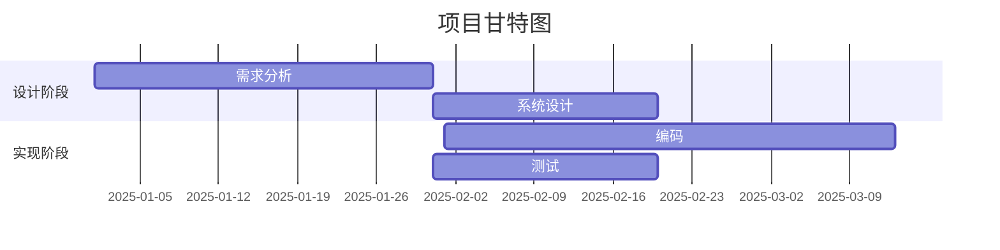
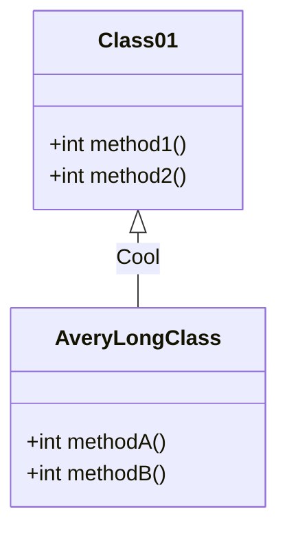
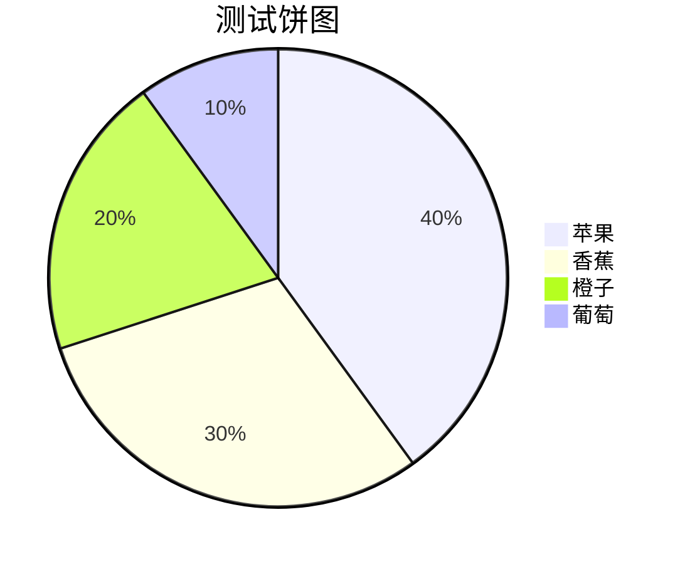
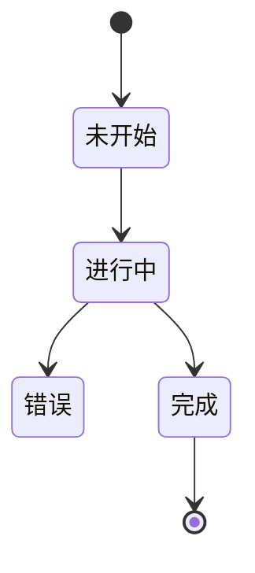
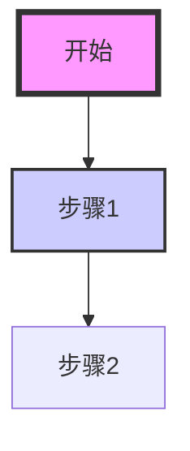

当然！以下是每种类型图表的完整 Mermaid 脚本，您可以直接使用这些脚本在支持 Mermaid 的环境中生成相应的图表。

如果描述内容中包含中文：分号，括号等，需要使用英文引号把内容包起来，否则mermaid语法不能正确识别。

### 1. 流程图 (Flowchart)

```mermaid
graph TD;
    A[开始] --> B{判断条件};
    B -- 是 --> C[执行操作1];
    B -- 否 --> D[执行操作2];
    C --> E[结束];
    D --> E;
```

### 2. 序列图 (Sequence Diagram)

- `->>+` ：发送消息，并**激活接收者**（在接收者生命线上显示激活框）。
- `->>-` ：发送消息，并**停用发送者**（关闭发送者的激活框）。
- 同理，`-->>+` 和 `-->>-` 用于虚线消息。

```mermaid
sequenceDiagram;
    Alice->>+John: 你好，John！
    John-->>-Alice: 你好，Alice！
    Alice->>+John: 你今天好吗？
    John-->>-Alice: 我很好，谢谢！
    John-->>+John: 不好处理
    Alice->>+John: Hello
    John->>John: 自己处理
    John-->>-Alice: Hi
```

`activate/deactivate`主动激活某层，添加生命周期：

```mermaid
sequenceDiagram;
    Alice->>+John: Hello
    John->>John: 转换Hello
    John->>-Tony: 你好
    activate Tony
    Tony->>Tony: 处理“你好”
    Tony-->>+John: 你好
    deactivate Tony
    John-->>John: 转换“你好”
    John-->>-Alice: Hello
```

### 3. 甘特图 (Gantt Chart)

```mermaid
gantt
    title 项目甘特图
    dateFormat  YYYY-MM-DD
    section 设计阶段
    需求分析           :a1, 2025-01-01, 30d
    系统设计           :after a1  , 20d
    section 实现阶段
    编码               :2025-02-01  , 40d
    测试               :after a1  , 20d
```

### 4. 类图 (Class Diagram)

```mermaid
classDiagram-v2
    Class01 <|-- AveryLongClass : Cool
    class Class01 {
        +int method1()
        +int method2()
    }
    class AveryLongClass {
        +int methodA()
        +int methodB()
    }
```

### 5. 饼图 (Pie Chart)

```mermaid
pie
    title 测试饼图
    "苹果": 40
    "香蕉": 30
    "橙子": 20
    "葡萄": 10
```

### 6. 状态图 (State Diagram)

```mermaid
stateDiagram-v2
    [*] --> 未开始
    未开始 --> 进行中
    	进行中 --> 错误
    	进行中 --> 完成
    完成 --> [*]
```

### 7. 自定义样式的流程图

```mermaid
graph TD;
    A[开始] --> B[步骤1];
    B --> C[步骤2];
    style A fill:#f9f,stroke:#333,stroke-width:4px
    style B fill:#ccf,stroke:#333,stroke-width:2px
```

### 使用说明

您可以将这些 Mermaid 脚本复制到支持 Mermaid 的 Markdown 编辑器或在线 Mermaid 编辑器中（如 [Mermaid Live Editor](https://mermaid-js.github.io/mermaid-live-editor/)）进行可视化。只需将脚本粘贴到编辑器中，然后渲染即可查看相应的图表。