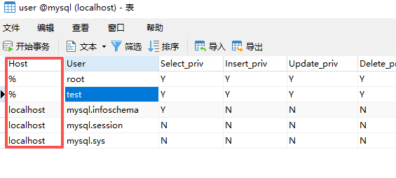
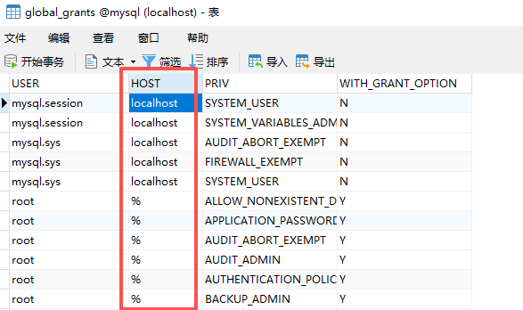
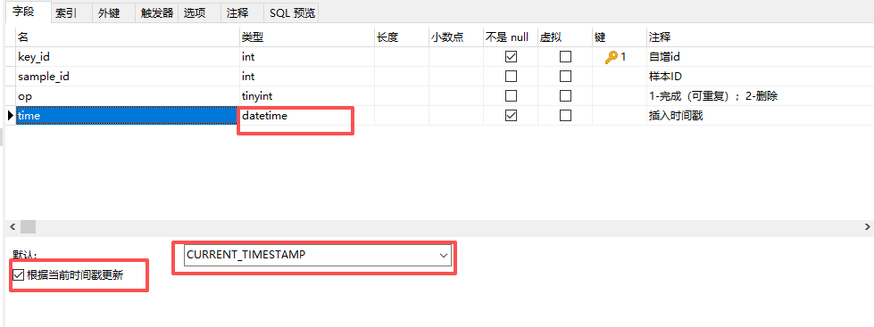

# mysql总结


## 1. mysql基础

ref: [参考](https://blog.csdn.net/mysnsds/article/details/125313346)

### 1.1 sql语句执行顺序

```sql
（8）Select
（9）distinct 字段名1,字段名2，
（6）[func(字段名)]  
（1）from 表1
（3）<join类型>join 表2 
（2）on <join条件> 
（4）where <where条件> 
（5）group by <字段> 
（7）having <having条件> 
（10）order by <排序字段> 
（11）limit <起始偏移量,行数>
```


### 1.2 mysql游标

**注意：**

1. 变量的声明必须在游标声明之前；
2. 处理程序的声明必须在游标声明之后；


- 不能定义多个*相同*处理程序；

  ```mysql
  DECLARE done1 INT DEFAULT FALSE;
  DECLARE done2 INT DEFAULT FALSE;
  
  -- 声明第一个游标
  DECLARE cursor1 CURSOR FOR SELECT column_name FROM table1;
  
  -- 声明第二个游标
  DECLARE cursor2 CURSOR FOR SELECT column_name FROM table2;
  
  -- 声明处理程序(**这样多个处理程序的处理方式是不正确的**)
  DECLARE CONTINUE HANDLER FOR NOT FOUND SET done1 = TRUE;
  DECLARE CONTINUE HANDLER FOR NOT FOUND SET done2 = TRUE;
  
  -- 声明统一处理程序
  DECLARE CONTINUE HANDLER FOR NOT FOUND 
  BEGIN
      IF current_cursor = 1 THEN
          SET done1 = TRUE; 
      ELSE
          SET done2 = TRUE; 
      END IF;
  END;
  ```

  

- 定义不同的处理程序；

  ```mysql
  DECLARE done1 INT DEFAULT FALSE;
  DECLARE done2 INT DEFAULT FALSE;
  
  -- 声明第一个游标
  DECLARE cursor1 CURSOR FOR SELECT column_name FROM table1;
  
  -- 声明第二个游标
  DECLARE cursor2 CURSOR FOR SELECT column_name FROM table2;
  
  -- 第一个处理程序
  DECLARE CONTINUE HANDLER FOR NOT FOUND SET done1 = TRUE;
  
  -- 第二个处理程序：处理某个特定错误代码（例如：1062，重复键错误）
  DECLARE CONTINUE HANDLER FOR SQLEXCEPTION 
  BEGIN
      SET done2 = 1;  -- 处理错误
  END;
  ```

  

- 在一个存储过程中使用多个游标的完整示例；

  ```mysql
  DELIMITER ;;
  
  CREATE PROCEDURE example_procedure()
  BEGIN
      DECLARE done1 INT DEFAULT FALSE;
      DECLARE done2 INT DEFAULT FALSE;
      DECLARE current_cursor INT DEFAULT 1; -- 用于跟踪当前游标
  
      -- 声明第一个游标
      DECLARE cursor1 CURSOR FOR SELECT column_name FROM table1;
      
      -- 声明第二个游标
      DECLARE cursor2 CURSOR FOR SELECT column_name FROM table2;
  
      -- 声明统一处理程序
      DECLARE CONTINUE HANDLER FOR NOT FOUND 
      BEGIN
          IF current_cursor = 1 THEN
              SET done1 = TRUE; 
          ELSE
              SET done2 = TRUE; 
          END IF;
      END;
  
      OPEN cursor1;
  
      -- 游标循环
      fetch_loop1: LOOP
          FETCH cursor1 INTO ...; -- 替换为实际的列名（可以是多个数据列）
          IF done1 THEN
              LEAVE fetch_loop1;
          END IF;
  
          -- 处理数据逻辑
      END LOOP fetch_loop1;
  
      CLOSE cursor1;
  
      -- 切换到第二个游标
      SET current_cursor = 2;
  
      OPEN cursor2;
  
      -- 游标循环
      fetch_loop2: LOOP
          FETCH cursor2 INTO ...; -- 替换为实际的列名（可以是多个数据列）
          IF done2 THEN
              LEAVE fetch_loop2;
          END IF;
  
          -- 处理数据逻辑
      END LOOP fetch_loop2;
  
      CLOSE cursor2;
  END ;;
  
  DELIMITER ;
  ```

### 1.3 mysql导入数据

1. 导入数据量大时，需要增加max_allowed_packet选项，否则容易失败;
2. 如果db.sql存在二进制数据，在navicat工具中导入数据可能会出错；

```sh
mysql -uroot -p123456 -h127.0.0.1 --max_allowed_packet=512M dest < source.sql
```

如果出现`ERROR 1366 (HY000) at line 226: Incorrect string value: '\xAE\xAF\xE8\xAF\xB7\xE6...' for column '...' at row 1`的错误，尝试指定默认编码方式进行数据导入：

```sh
mysql -uroot -p123456 --max_allowed_packet=512M --default-character-set=utf8 dest < source.sql
```


### 1.4 mysql访问控制

- 修改密码

  记得密码的前提下，进入mysql控制台

  ```sql
  ALTER USER '用户'@'%' IDENTIFIED BY '你的密码';
  ```

- **查看用户权限**

  在 MySQL 中，你可以通过查询 `mysql.user` 表来查看用户的访问权限。使用以下 SQL 查询查看某个用户的权限：

  ```sh
  SELECT host, user FROM mysql.user;
  ```

  这将列出所有用户及其允许连接的主机（即 IP 地址或主机名）。如果一个用户的 `host` 字段是 `'%'`，则表示该用户可以从任何主机连接。

- **查看某个用户的具体权限**

  如果你想查看某个特定用户的详细权限，可以使用 `SHOW GRANTS` 命令：

  ```sh
  SHOW GRANTS FOR 'username'@'hostname';
  ```

- **调整用户权限**

  默认情况下，MySQL 用户只允许从本地（`localhost`）连接。你需要为需要外部访问的用户授予权限。

  假设你的用户名是 `test`，密码是 `123456`，并且你希望从任何主机连接：

  ```sh
  // %: 所有ip均可访问
  CREATE USER 'test'@'%' IDENTIFIED BY '123456';
  GRANT ALL PRIVILEGES ON *.* TO 'test'@'%';
  FLUSH PRIVILEGES;
  ```

- 直接修改系统表

  - 修改user表的host信息为%：

  

  - 修改global_grants的host为%：

    

    **注意：**

    1. 修改这2项信息之后，重启mysql服务；
    
  2. windows下运行命令行工具`mysql -uroot -p`需要在cmd下；
    
    3. sql文件里更新在8.0以上版本会执行失败：`ERROR 1227 (42000): Access denied; you need (at least one of) the SYSTEM_USER privilege(s)`
    
       ```sql
       update mysql.user set Host='%' where User='root';
       update mysql.global_grants set HOST='%' where USER='root';
       FLUSH PRIVILEGES;
       ```
    
       应在脚本中使用如下方式增加远程访问控制：
    
       ```sql
       CREATE USER 'root'@'%' IDENTIFIED BY '123456';
       GRANT ALL PRIVILEGES ON *.* TO 'root'@'%' WITH GRANT OPTION;
       FLUSH PRIVILEGES;
       ```
    

- 


### 1.5 自动更新操作时间

```mysql
CREATE TABLE your_table (
    id INT AUTO_INCREMENT PRIMARY KEY,
    created_at DATETIME DEFAULT CURRENT_TIMESTAMP,
    updated_at DATETIME DEFAULT CURRENT_TIMESTAMP ON UPDATE CURRENT_TIMESTAMP
);
```

在navicat工具中设置如下：




## 2. mysql优化建议（技巧）

**扩展**：参考https://www.cnblogs.com/jajian/p/9758192.html

- 整型定义中无需定义显示宽度，比如：使用INT，而不是INT(4)。

- 建议字段定义为`NOT NULL`。

- 对于非Index索引字段作为where条件时，如果确认结果只有一个，可以使用limit 1来提高查询速度。

- 索引中的字段数建议不超过5个。

- 单张表的索引个数控制在5个以内。

- InnoDB表一般都建议有主键列（必须）。

- 建立复合索引时，优先将选择性高的字段放在前面。

- `UPDATE、DELETE`语句需要根据`WHERE`条件添加索引。

- 不建议使用%前缀模糊查询，例如`LIKE “%weibo”`，无法用到索引，会导致全表扫描（但可使用`“weibo%”`）。

- 避免在索引字段上使用函数，否则会导致查询时索引失效。（`select xxx from tab1 where day(DateTime) > 15`）

- 考虑*使用limit N，少用limit M，N*，特别是大表或M比较大的时候。

- SQL语句中IN包含的值不应过多。

- WHERE条件中的字段值需要符合该字段的数据类型，避免MySQL进行隐式类型转化。

- SELECT、INSERT语句必须显式的指明字段名称，禁止使用`SELECT *` 或是`INSERT INTO table_name values()`。

- SQL中尽可能避免反连接，避免半连接，这是优化器做得薄弱的一方面，什么是反连接，半连接？其实比较好理解，举个例子，not in ,not exists就是反连接，in,exists就是半连接，在千万级大表中出现这种问题，性能是几个数量级的差异。

- 尽可能避免或者杜绝多表复杂关联，大表关联是大表处理的噩梦，一旦打开了这个口子，越来越多的需求需要关联，性能优化就没有回头路了，更何况大表关联是MySQL的弱项，尽管Hash Join才推出，不要像掌握了绝对大杀器一样，在商业数据库中早就存在，问题照样层出不穷。

- 尽可能杜绝范围数据的查询，范围扫描在千万级大表情况下还是尽可能减少。

- 不要对字段建立多个索引。

- 使用`explain/desc select`来分析SQL语句执行前的执行计划。

- 使用缓存：避免在查询条件中使用不确定的值。（像now(),datetime()之类的）

**注意**：在查询时，MYSQL只能使用一个索引，如果建立的是多个单列的普通索引，在查询时会根据查询的索引字段，从中选择一个限制最严格的单例索引进行查询。别的索引都不会生效。


### 2.1 MySQL建表的时候有哪些优化手段？

- **合理选择数据类型**：根据实际存储的数据范围选择合适的数值类型，避免使用过大的数据类型造成空间浪费。例如，如果存储的整数范围在 0 - 255 之间，使用 `TINYINT` 即可，而不是 `INT`。对于固定长度的字符串，使用 `CHAR` 类型；对于可变长度的字符串，使用 `VARCHAR` 类型。同时，根据实际存储的字符串长度合理设置字段长度。
- **控制字段数量**：避免创建过多不必要的字段，过多的字段会增加表的复杂度和存储开销，同时也会影响查询性能。可以将一些不常用的字段单独存储在其他表中，通过关联查询获取数据。
- **反范式化设计**：可以适当引入一些数据冗余，将相关联的数据存储在同一个表中，减少表之间的关联查询。需要在范式化和反范式化之间找到一个平衡点。
- **合理创建索引**：在经常用于 `WHERE` 子句、`JOIN` 子句和 `ORDER BY` 子句的字段上创建索引，以提高查询效率。避免在重复值较多的字段上创建索引，因为这样的索引效果不佳。例如，在一个性别字段上创建索引可能没有太大意义。当然，过多的索引会增加存储开销和写操作的性能开销，因此要根据实际查询需求合理创建索引，避免创建过多不必要的索引。


## 3. 版本升级 5.7->8.4

迁移数据时，使用**mysql shell**可以快速迁移（备份5.7迁移到8.4中）


### 3.1使用mysql_config_editor配置密码

导出/导入数据时，需要多次输入密码，或者在脚本中写入明文密码，容易造成密码泄露，容易引发安全风险，通过mysql_config_editor可以避免该问题。


### 3.2 使用mysql shell解决数据迁移很慢问题

- mysqldump导出数据速度尚可，但是使用mysql db<backup.sql导入数据会很慢；

- 10G的数据大概会耗时70分钟左右，我们一定会面临更大的数据库，所以必须要使用其他工具；

- 使用 mysql shell 可以提升迁移速度。

```sh
# 导出
mysqlsh root@10.18.92.74:3306 --password --js -e "util.dumpSchemas(['mydb'], 'D:/mysql_dump/mydb', {threads:8, chunking:true, bytesPerChunk:'256M', compression:'zstd'})"

# 开启local_infile然后执行导入
show global VARIABLES like 'local_infile'
set global local_infile=ON;

mysqlsh root@host --mysql --execute "SET GLOBAL local_infile=1"

# 导入
mysqlsh root@127.0.0.1:3306 --password --js -e "util.loadDump('D:/mysql_dump/mydb', {threads: 8})"
```


### 3.3 迁移过程中存在的其他问题

https://dev.mysql.com/doc/refman/8.0/en/upgrading-from-previous-series.html

以下是升级过程中的注意事项：

- 5.7的sql脚本是gbk（gb2312）编码的，在bat脚本中能够正常识别，但8.4中需要把sql文件转换为utf8编码，并且在bat脚本中加入以下内容，让bat支持utf8

  ```bat
  @echo off
  
  // 新增内容，用以在bat中支持utf8编码
  chcp 65001 > nul
  setlocal enabledelayedexpansion
  
  set host=127.0.0.1
  set user=root
  set psw=xxx
  set name=test
  set sqlpath=%~dp0
  set sqlfile=update.sql
  cd /d C:\Program Files\MySQL\MySQL Server 8.4\bin
  
  mysql -h%host% -u%user% -p%ps% %name%< %sqlpath%%sqlfile%
  pause
  ```

  - MySQL 5.7 默认使用 latin1 或 utf8，对编码检查较宽松；
  - MySQL 8.0+ 默认使用 utf8mb4，且对非法字符检查更严格；

  

- 8.4 不再支持`table_name.field`方式对字段进行修改：

  ```sql
  // 错误，字段前不能在带表名
  ALTER TABLE tb_sample MODIFY tb_sample.`Range` VARCHAR(256) DEFAULT NULL COMMENT '参考范围';
  ```

  

- 5.7备份数据导入8.4很慢问题

  - 二进制日志（binlog）开了：开启 binlog 时，每个事务的修改都要写入 binlog，会增加磁盘 IO。若导入是很多小事务或大量单行 INSERT，binlog 写入开销会非常明显，尤其是 binlog_format=ROW（记录整行数据）时更大。
  - 事务粒度小 / autocommit=ON：mysqldump 导出的 SQL 若产生大量独立事务（每条 INSERT 都提交），会触发多次 fsync/写入，慢得很。
  - 索引和外键约束：导入时如果有大量索引/外键检查，会导致每条插入都做额外开销。
  - 字符集转换：5.7 默认是 utf8（3 字节），8.x 常用 utf8mb4（4 字节）。导入时 MySQL 可能做字符集转换，增加 CPU 与内存负担（通常不是主要瓶颈，但会有影响）。
  - 写入参数/刷盘策略：innodb_flush_log_at_trx_commit、sync_binlog 等默认设置追求 Durability，会频繁刷盘，影响吞吐。
  - 导入方式单线程：mysqldump + mysql client 是单线程写入，面对大数据量本身有限。

  

  windows下执行导入命令：

  ```bat
  "C:\Program Files\MySQL\MySQL Server 8.4\bin\mysql.exe" -uroot -pPassword --max_allowed_packet=512M --default-character-set=utf8 --init-command="SET GLOBAL sync_binlog=0;SET GLOBAL innodb_flush_log_at_trx_commit=2;" dbname < backup.sql
  ```

  数据导入之后重启MySQL服务（对于普通用户来说，直接重启电脑）

  

  参数说明：`my.ini`

  ```ini
  // If set to 1, InnoDB will flush (fsync) the transaction logs to the
  // disk at each commit, which offers full ACID behavior. If you are
  // willing to compromise this safety, and you are running small
  // transactions, you may set this to 0 or 2 to reduce disk I/O to the
  // logs. Value 0 means that the log is only written to the log file and
  // the log file flushed to disk approximately once per second. Value 2
  // means the log is written to the log file at each commit, but the log
  // file is only flushed to disk approximately once per second.
  innodb_flush_log_at_trx_commit=1
  
  // 控制MySQL服务器何时将二进制日志（binlog）刷新到磁盘：每N个事务fsync一次，N=0依赖OS刷新，不主动fsync
  sync_binlog=1
  ```

  显示mysql的某些变量值：`SHOW VARIABLES LIKE '%var%'`（e.g. `show variables like '%sync_binlog%'`）

- 如果表的字段为blob，在navicat中查看到的数据长度就是不准确的；


## 4. mysql 核心配置

- sync_binlog&innodb_flush_log_at_trx_commit

  ```ini
  # 场景1：电商核心交易
  sync_binlog = 1
  innodb_flush_log_at_trx_commit = 1
  # 解释：不能丢失任何交易数据
  
  # 场景2：社交网站
  sync_binlog = 1000
  innodb_flush_log_at_trx_commit = 2
  # 解释：可容忍少量数据丢失，追求高性能
  
  # 场景3：日志分析系统
  sync_binlog = 0
  innodb_flush_log_at_trx_commit = 0
  # 解释：数据可重建，追求最大吞吐量
  
  # 场景4：主从复制中的从库
  sync_binlog = 100
  innodb_flush_log_at_trx_commit = 2
  # 解释：从库可接受一定延迟
  ```

  

- 开启binlog（CDC）

  ```ini
  # binlog 格式（CDC 必须）
  binlog_format=ROW
  
  # 每条行变更都记录前后值（推荐）
  binlog_row_image=FULL
  
  # 建议：开启 GTID（强烈推荐）
  gtid_mode=ON
  enforce_gtid_consistency=ON
  ```

  

- 


## 5. 杂项

### 5.1 怎么可以做到不在脚本中使用明文登录mysql或处理数据导出等操作？

脚本中出现明文：

```sh
# 明文登录数据库
mysql -uroot -p123456

# 明文备份数据库
mysqldump -uroot -p123456 mydb > backup.sql
```

改进：

```sh
# 通过命令行设置一次账号密码
mysql_config_editor set --login-path=local57 --user=root --password

# 显示设置信息
mysql_config_editor print --all

# 后续登录使用指定信息进行登录
mysql --login-path=local57

# 备份数据
mysqldump --login-path=local57 mydb > backup.sql
```

`mysql_config_editor` 配置的 login-path 信息存储在一个名为 `.mylogin.cnf` 的文件中，这是一个加密的配置文件。

它的具体存储位置会根据你的操作系统有所不同：

- **Windows 系统**: `%APPDATA%\MySQL` 目录下；
- **非 Windows 系统 (Linux, macOS 等)**: 当前用户的主 (`home`) 目录下；

通常情况下，这个文件在你第一次使用 `mysql_config_editor` 命令时自动创建。

- 