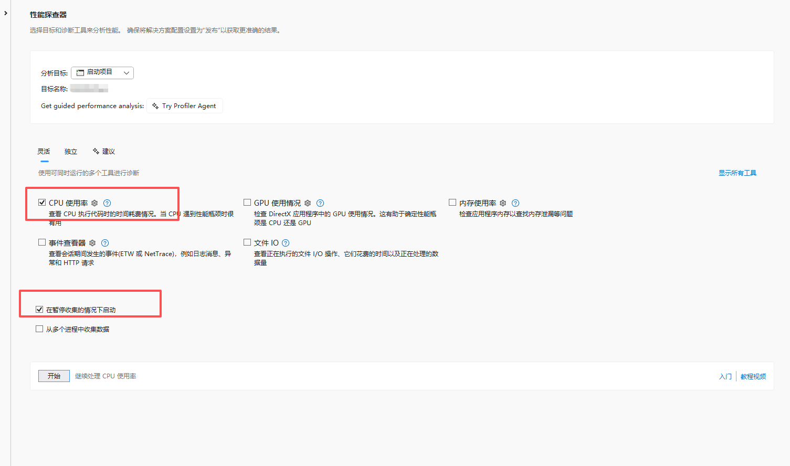
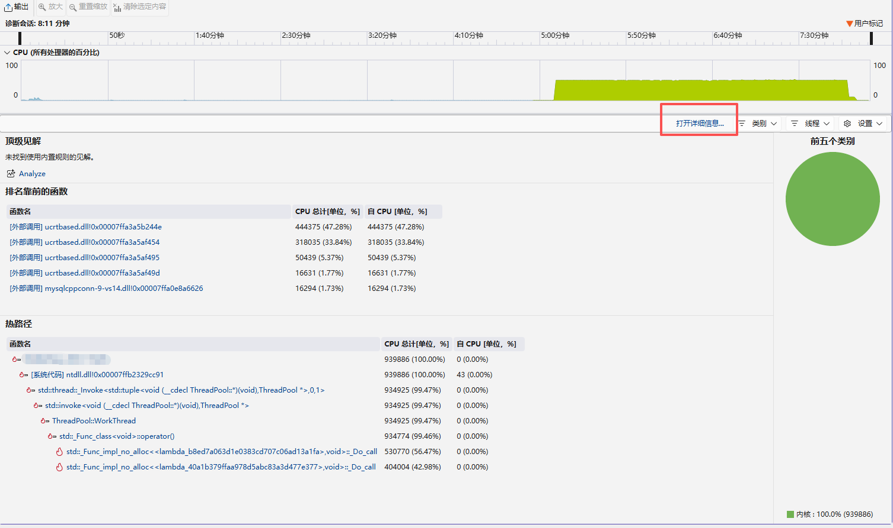
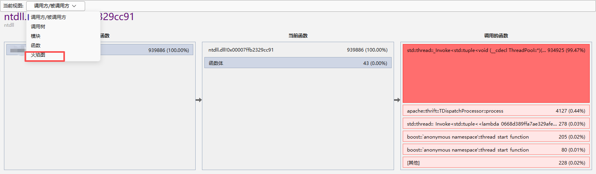
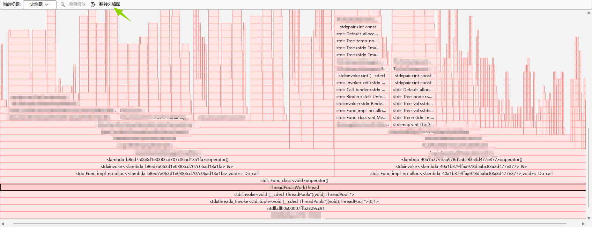

- 性能分析工具使用
  - [Linux性能分析工具 Perf使用](#Ⅰ. Linux性能分析工具 Perf使用)
  - [Windows下在visual studio工具使用性能分析工具](#Ⅱ. Windows下在visual studio工具使用性能分析工具)


# 性能分析工具使用

性能分析工具运行之后，通过火焰图可以直观的看到热点函数，程序可以基于分析结果做针对性优化。

[Linux Perf工具使用参考](https://blog.csdn.net/jasonactions/article/details/109332167)

[Windows vs中使用参考](https://learn.microsoft.com/zh-cn/visualstudio/profiling/cpu-usage?view=visualstudio#collect-cpu-utilization-data)


## Ⅰ. Linux性能分析工具 Perf使用

- `perf record/report`

  ```ini
  # -e cpu-clock指定分析事件；可以使用perf list查看支持的事件;
  # -p pid指定分析进程；选填
  perf record -e cpu-clock -p pid
  
  # 根据record生成的perf.data，生成报告;默认为perf.data
  perf report [-i input]
  ```

- `perf top`

  ```ini
  # 对于一个指定的性能事件（默认是CPU周期）显示消耗最多的函数/命令
  # 直接使用该命令直接分析
  # -p pid指定需要分析的进程；选填
  perf top [-p pid]
  ```

- `perf stat`

  ```ini
  # 分析程序的性能概况
  perf stat [-p pid]
  ```


​	**生成火焰图**

1. 安装依赖工具

   克隆`FlameGraph`工具库：

   ```sh
   git clone https://github.com/brendangregg/FlameGraph.git
   ```

2. 使用perf record记录性能数据

   注意要加-g参数：

   ```sh
   perf record -F 99 -g -- <command> #
   # 示例
   perf record -F 99 -a -g -- sleep 30 # 监控所有cpu的cycles事件30s
   ```

3. 导出数据为文本格式
将perf.data转换为可处理的文本;

   ```sh
   perf script > output.perf
   ```
   
4. 使用`FlameGraph`工具链处理数据：

   ```sh
   // 折叠调用栈（统计相同路径）
	stackcollapse-perf.pl < output.perf > output.folded
   
	// 生成svg火焰图
   flamegraph.pl output.folded > flamegraph.svg

   // 命令简化，一步完成
   perf script | stackcollapse-perf.pl | flamegraph.pl > flamegraph.svg
   ```


## Ⅱ. Windows下在visual studio工具使用性能分析工具

1. 打开性能探查器

   使用快捷键 Alt+F2或者在vs的菜单中：调试 -> 性能探查器

2. 选择启动的项目，勾选CPU使用率（如果还有其他需要诊断的事件，自行勾选即可）

   **Note：**如果程序从运行就开始搜集性能数据，则不要勾选“在暂停收集的情况下启动”选项；

   

3. 待性能分析完成之后，点击停止收集

   **Note：**如果没有在上一步骤中勾选“在暂停收集的情况下启动”，则需要程序启动后，在合适的时机点击开始记录（e.g. 可以在我们需要分析的业务点开始之前点击记录按钮）。

   开始记录：

   

   停止收集：

   

4. 打开详细信息，选择火焰图，然后选择翻转火焰图，得到我们常用的视角

   

   

5. 基于以上信息，我们可以分析热点函数，对程序做针对性的优化。
   

