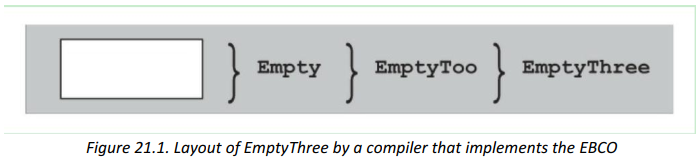
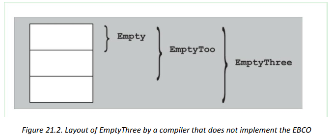
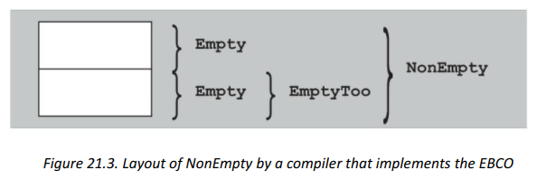

# CPP模板基础

## 1. 萃取

总体而言， 我们更倾向于使用如下（稍微模糊的） 定义：

- 萃取代表的是一个模板参数的本质的、 额外的属性；
-  策略代表的是泛型函数和类型（通常都有其常用地默认值） 的可以配置的行为。

为了进一步阐明两者之间可能的差异， 我们列出了如下和萃取有关的观察结果：

- 萃取在被当作固定萃取（fixed traits） 的时候会比较有用（比如， 当其不是被作为模板参数传递的时候） ；
-  萃取参数通常都有很直观的默认参数（很少被重写， 或者简单的说是不能被重写） ；
-  萃取参数倾向于紧密的依赖于一个或者多个主模板参数；
- 萃取在大多数情况下会将类型和常量结合在一起， 而不是成员函数。 萃取倾向于被汇集在萃取模板中。

对于策略类， 我们有如下观察结果：  

- 策略类如果不是被作为模板参数传递的话， 那么其作用会很微弱；
-  策略参数不需要有默认值， 它们通常是被显式指定的（虽有有些泛型组件通常会使用默认策略） ；
- 策略参数通常是和其它模板参数无关的。
- 策略类通常会包含成员函数；
-  策略可以被包含在简单类或者类模板。

```c++
// 策略示例：grep为策略方法

// 序列化struct数据到json对象中
template<typename T, typename F>
void struct_to_json(json &obj, const T &st, F&& grep)
{
    // ...
}

// Note：根据下面黑体描述内容，grep应该放在T的前面
```

但是， 两者之间并没有一个清晰的界限。 比如， C++标准库中的字符萃取就定义了一些函数行为（比如比较， 移动和查找字符） 。 通过替换这些萃取， 我们定义一个大小写敏感的字符类型， 同时又可以保留相同的字符类型。 因此， 虽然它们被称为萃取， 但是它们的一些属性和策略确实有联系的。  

如我们的实现所展现的那样， 萃取以及策略并不会完全摒除多模板参数的情况。 但是， 它们确实将萃取和模板的数量降低到了易于管理的水平。 然后就有了一个很有意思的问题， 该如何给这些模板参数排序？一个简单的策略是， 根据参数默认值被选择的可能型进行递增排序（也就是说， 越是有可能使用一个参数的默认值， 就将其排的越靠后） 。 比如说，**萃取参数通常要在策略参数后面，因为在客户代码中， 策略更可能被重写**。 


- 用 SFINAE 排除某些重载函数

  ```c++
  // 1.
  template<typename T>
  struct has_member_func_foo
  {
  private:
      template<typename U>
      static constexpr auto check(U*) -> decltype(std::declval<U>().foo(), std::true_type{});
  
      template<typename>
      static constexpr std::false_type check(...);
  
  public:
      static constexpr bool value = decltype(check<T>(nullptr))::value;
  };
  
  // 2.需要注意的是不能在第一个test中直接使用模板参数T
  template<typename T>
  struct has_member_func_foo {
  private:
      template<typename U, typename = decltype(std::declval<U>().foo())>
      static std::true_type test(void*);
      template<typename>
      static std::false_type test(...); // test() fallback:
  public:
      static constexpr bool value = decltype(test<T>(nullptr))::value;
  };
  
  // 3.
  template<typename T>
  struct has_mem_func_foo_helper {
  private:
      template<typename U, typename = decltype(std::declval<U>().foo())>
      static std::true_type test(U*);
      template<typename>
      static std::false_type test(...);
  
  public:
      using type = decltype(test<T>(nullptr));
  };
  
  template<typename T>
  struct has_member_func_foo : public has_mem_func_foo_helper<T>::type {};
  
  // 以上3种方法都可以用于判断是否存在成员函数foo
  ```

- 用 SFINAE 排除偏特化  

  ```c++
  template<typename T>
  struct IsDefaultConstructibleT {
  private:
      template<typename U, typename = decltype(U())>
      static std::true_type test(void*);
      template<typename>
      static std::false_type test(...); // test() fallback:
  public:
      static constexpr bool value = decltype(test<T>(nullptr))::value;
  };
  
  //----------------------------------------------------------------------------------
  
  template<typename T>
  struct IsDefaultConstructibleTHelper {
  private:
      template<typename U, typename = decltype(U())>
      static std::true_type test(void*);
      template<typename>
      static std::false_type test(...); // test() fallback:
  public:
      using Type = decltype(test<T>(nullptr));
  };
  
  template<typename T>
  struct IsDefaultConstructibleT : public IsDefaultConstructibleTHelper<T>::Type {};
  
  //----------------------------------------------------------------------------------
  
  // 别名模板， helper to ignore any number of template parameters:
  template<typename …> using VoidT = void;
  
  // primary template:
  template<typename, typename = VoidT<>>
  struct IsDefaultConstructibleT : std::false_type { };
  
  // partial specialization (may be SFINAE’ d away):
  template<typename T>
  struct IsDefaultConstructibleT<T, VoidT<decltype(T())>> : std::true_type { };
  
  // 针对我们的例子， 只需要一个类型构造：
  // decltype(T())
  // 这样就可以检测类型 T 是否是可以被默认初始化的。 如果对于某个特定的类型 T， 其默认构
  // 造函数是无效的， 此时 SIFINEAE 就是使该偏特化被丢弃掉， 并最终使用主模板。 否则该偏
  // 特化就是有效的， 并且会被选用。
  ```

  

- 基于SFINAE的萃取

  作为一般的设计原则，在给定了合理的模板参数的情况下，萃取模板永远不应该在实例化阶段出错。其实需要进行两次相关检查：

  1. 一次是检查相关操作是否有效
  2. 一次是计算其结果

  ```c++
  template<typename T1, typename T2>
  struct PlusResultT {
      using Type = decltype(std::declval<T1>()+std::declval<T2>());
  }
  
  class Array {
      ...
  };
  
  template<typename T1, typename T2>
  Array<typename PlusResultT<T1,T2>::Type> operator+(Array<T1> const&, Array<T2> const&);
  
  // 很显然，如果没有为数组元素定义合适的+运算符的话，使用PlusResultT<>就会遇到错误。
  class A;
  class B;
  
  auto arrayA = Array<A>;
  auto arrayB = Array<B>;
  auto sum = arrayA + arrayB; // error: fails in instantiation of PlusResultT<A,B>
  
  // 这里的问题并不是错误会发生在代码明显有问题的地方（没办法对元素类型分别为A和B的数组进行求和），
  // 而是会发生在对operator+进行模板参数推断的时候，在很深层次的PlusResultT<A,B>的实例化中。
  // 这会导致一个很值得注意的问题：即使我们为A和B的数组重载了一个求和的函数，程序依然可能会遇到编译错误；
  
  // primary template
  template<typename T1, typename T2>
  Array<typename PlusResultT<T1,T2>::Type> operator+(Array<T1> const&, Array<T2> const&);
  
  // overload + for concrete types
  Array<A> operatpr+(Array<A> const& arrayA, Array<B> const& arrayB);
  
  auto sum = arrayA + arrayB; // error?: 由编译器决定是否实例化PlusResultT<A,B>模板
  // 如果编译器可以在不对第一个operator+模板声明进行推断和替换的情况下，
  // 就能够判断除第二个operator+声明会更加匹配的话，上述代码就不会有问题。
  
  // 但是，在推断或者替换一个备选函数模板时，任何发生在模板定义的实例化过程中
  // 的事情都不是函数模板替换直接上下文，SFINAE也不会保护我们在其中构建无效类型或者表达式。
  // 此时并不会丢弃这一函数模板待选项，而是会立即报出试图在PlusResultT<>中为A和B类型调用operator+的错误。
  
  // 为了解决这这一问题，我们必须要将PlusResultT变成SFINAE友好的，也就是说需要为之提供更恰当的定义，以使其在decltype中遇到错误，也不会诱发编译错误。所以额外定义一个模板HasPlusT。
  
  template<typename,typename, typename=std::void_t<>>
  struct HasPlusT : std::false_type {};
  
  // 模板部分特化：**注意函数模板不能部分特化，避免与函数重载发生冲突**
  template<typename T1, typename T2>
  struct HasPlusT<T1, T2, std::void_t<std::decltype(std::declval<T1>()+std::declval<T2>())>> : std::true_type {};
  
  // 如果其返回结果为true，PlusResultT就可以使用现有的实现，否则，PlusResultT就需要一个安全的默认实现。
  // 对于一个萃取，如果对某一组模板参数它不能生成有意义的结果，那么最好的默认行为就是不为其提供Type成员。
  // 这样，如果崔五被用于SFINAE上下文中，缺少Type成员会导致模板参数推断出错，这也正是我们所其期望的，array类型的operator+模板的行为。
  template<typename T1, typename T2, bool=HasPlusT<T1,T2>::value>
  struct PlusResultT {
      using Type = decltype(std::declval<T1>() + std::declval<T2>());
  };
  
  template<typename T1, typename T2>
  struct PlusResultT<T1, T2, false> { // partial specialization, used otherwise.
  };
  
  // 在这一版的实现中，我们引入了一个有默认值的模板参数，它会使用上文中的HasPlusT来判断前面两个模板参数是否支持求和操作。
  // 然后我们对于第三个模板参数的值为false的情况进行了偏特化，而且在该偏特化中没有任何成员，从而避免了我们所描述过的问题。
  // 对于支持求和操作的情况，第三个参数值是true，因此会选用柱模版，也就是定义了Type成员的那个模板。这样就保证了只有对支持+操作的类型，
  // PlusResultT才会提供返回类型。（注意，被进行求和的模板参数不应该被显示的指定参数----这句话没有理解到？？？）
  ```

  

- 探测成员或表达式

  ```c++
  // primary template.
  template<typename, typename, typename = std::void_t<>>
  struct HasLessT : std::false_type { };
  
  // partial specialization(may be SFINAE's away)
  template<typename T1, typename T2>
  struct HasLessT<T1, T2, std::void_t<decltype(std::declval<T1>() < std::declval<T2>())>> : std::true_type { };
  
  // 和往常一样，问题的难点在于该如果为所要测试的条件定义一个有效的表达式，并通过使用
  // decltype将其放入SFINAE的上下文中，在该表达式无效的时候，SFINAE机制会让我们最终选择主模板;
  
  HasLessT<int, char>::value; // true
  HasLessT<std::string, int>::value; // false
  HasLessT<std::string, std::string>::value; // true
  HasLessT<std::string, char*>::value; // true
  
  
  // 值得注意的是， 基于 std::void_t 的特性， 我们可以将多个限制条件放在同一个萃取中
  // primary template.
  template<typename, typename = std::void_t<>>
  struct HasVariousT : std::false_type { };
  
  // partial specialization(may be SFINAE's away)
  template<typename T>
  struct HasVariousT<T, std::void_t<decltype(std::declval<T>().begin(),
                                             typename T::difference_type,
                                             typename T::iterator)>> : std::true_type { };
  
  // 能够测试某一语法特性有效性的萃取是很有用的，基于有或者没有某一特定操作，可以用该
  // 萃取去客制化模板的行为。这一类萃取既可以被用于SFINAE友好的萃取的一部分，也可以为基于类型特性的重载提供帮助。
  ```

  

- If-Then-Else（标准库`std::conditional`）

  ```c++
  // primary template: yield the second argument by default and rely on
  // a partial specialization to yield the third argument
  // if Cond is false
  template<bool Cond, typename TrueType, typename FalseType>
  struct IfThenElseT {
      using Type = TrueType;
  };
  
  // partial specialization: false yields third argument
  template<typename TrueType, typename FalseType>
  struct IfThenElseT<false, TrueType, FalseType> {
      using Type = FalseType;
  };
  
  template<bool Cond, typename TrueType, typename FalseType>
  using IfThenElse = typename IfThenElseT<Cond, TrueType, FalseType>::Type;
  
  // 需要注意的是， 和常规的 C++ if-then-else 语句不同， 在最终做选择之前， then 和 else 分支
  // 中的模板参数都会被计算， 因此两个分支中的代码都不能有问题， 否则整个程序就会有问题。
  // 考虑下面这个例子， 一个可以为给定的有符号类型生成与之对应的无符号类型的萃取。 已经
  // 有一个标准萃取（ std::make_unsigned） 可以做这件事情， 但是它要求传递进来的类型是有
  // 符号的整形， 而且不能是 bool 类型； 否则它将使用未定义行为的结果（参见第 D.4 节） 。
  // 这一萃取不够安全， 因此最好能够实现一个这样的萃取， 当可能的时候， 它就正常返回相应
  // 的无符号类型， 否则就原样返回被传递进来的类型（这样， 当传递进来的类型不合适时， 也
  // 能避免触发未定义行为） 。 下面这个简单的实现是不行的：
  
  // ERROR: undefined behavior if T is bool or no integral type:
  //template<typename T>
  //struct UnsignedT {
  //    using Type = IfThenElse<std::is_integral<T>::value
  //        && !std::is_same<T, bool>::value, typename std::make_unsigned<T>::type,
  //        T>;
  //};
  
  // 因为在实例化 UnsingedT<bool>的时候， 行为依然是未定义的，
  // **编译期依然会试图从下面的代码中生成返回类型:**
  // typename std::make_unsigned<T>::type
  
  // 为了解决这一问题， 我们需要再引入一层额外的间接层， 从而让 IfThenElse 的参数本身用类
  // 型函数去封装结果：
  
  // yield T when using member Type:
  template<typename T>
  struct IdentityT {
      using Type = T;
  };
  
  // to make unsigned after IfThenElse was evaluated:
  template<typename T>
  struct MakeUnsignedT {
      using Type = typename std::make_unsigned<T>::type;
  };
  
  template<typename T>
  struct UnsignedT {
      using Type = typename IfThenElse<std::is_integral<T>::value && !std::is_same<T, bool>::value,
          MakeUnsignedT<T>,
          IdentityT<T>>::Type;
  };
  
  // 在这一版 UnsignedT 的定义中， IfThenElse 的类型参数本身也都是类型函数的实例。 只不过
  // 在最终 IfThenElse 做出选择之前， 类型函数不会真正被计算(这里我认为是涉及到模板编译的两阶段查找)。
  // 而是由 IfThenElse 选择合适的类型实例（MakeUnsignedT 或者 IdentityT） 。
  // 最后由::Type 对被选择的类型函数实例进行计算， 并生成结果 Type。
  // 此处值得强调的是， 之所以能够这样做， 是因为 IfThenElse 中未被选择的封装类型永远不会被完全实例化。 
  // 下面的代码也不能正常工作：
  template<typename T>
  struct UnsignedT {
      using Type = typename IfThenElse<std::is_integral<T>::value
          && !std::is_same<T,bool>::value, MakeUnsignedT<T>::Type, T>::Type;
  };
  
  // 我们必须要延后对 MakeUnsignedT<T>使用::Type， 也就是意味着， 我们同样需要为 else 分支
  // 中的 T 引入 IdentyT 辅助模板， 并同样延后对其使用::Type。
  // 我们同样不能在当前语境中使用如下代码:
  template<typename T>
  using Identity = typename IdentityT<T>::Type;
  
  // 我们当然可以定义这样一个别名模板， 在其它地方它可能也很有用， 但是我们唯独不能将其
  // 用于 IfThenElse 的定义中， 因为任意对 Identity<T>的使用都会立即触发对 IdentityT<T>的完全
  // 实例化， 不然无法获取其 Type 成员。
  ```

  

- 探测不抛出异常的操作

  


## 2. 模板与继承

### 2.1 空基类优化 The Empty Base Class Optimization(EBCO)

C++中的类经常是“空” 的， 也就是说它们的内部表征在运行期间不占用内存。 典型的情况是那写只包含类型成员， 非虚成员函数， 以及静态数据成员的类。 而非静态数据成员， 虚函数， 以及虚基类， 在运行期间则是需要占用内存的。然而即使是空的类， 其所占用的内存大小也不是零。如果愿意的话， 运行下面的程序可以证明这一点：  

```c++
#include <iostream>
class EmptyClass {
};

int main()
{
	std::cout << "sizeof(EmptyClass):" << sizeof(EmptyClass) << ’ \n’ ;
}
```

在某些平台上， 这个程序会打印出 1。 在少数对 class 类型实施了严格内存对齐要求的平台上， 则可能会打印出其它结果（典型的结果是 4）  。


虽然在 C++中没有内存占用为零的类型， 但是 C++标准却指出， 在空 class 被用作基类的时候，如果不给它分配内存并不会导致其被存储到与其它同类型对象或者子对象相同的地址上， 那么就可以不给它分配内存 。下面通过一些例子来看看实际应用中空基类优化（ empty class optimization， EBCO） 的意义。 考虑如下程序：  

```c++
#include <iostream>

class Empty {
	using Int = int; // type alias members don’ t make a class nonempty
};

class EmptyToo : public Empty {
};

class EmptyThree : public EmptyToo {
};

int main()
{
    std::cout << "sizeof(Empty): " << sizeof(Empty) << ’ \n’ ;
    std::cout << "sizeof(EmptyToo): " << sizeof(EmptyToo) << ’ \n’ ;
    std::cout << "sizeof(EmptyThree): " << sizeof(EmptyThree) << ’ \n’ ;
}
```

如果你所使用的编译器实现了 EBCO 的话， 它打印出来的三个 class 的大小将是相同的， 但是它们的结果也都不会是零（参见图 21.1） 。 这意味着在 EmptyToo 中， Empty 没有被分配内存。 注意一个继承自优化后的空基类（且只有这一个基类） 的空类依然是空的。 这就解释了为什么 EmptyThree 的大小和 Empty 相同。 如果你所用的编译器没有实现 EBCO 的话， 那么它打印出来的各个 class 的大小将是不同的 。






考虑一种 EBCO 不适用的情况：  

```c++
#include <iostream>!
class Empty {
	using Int = int; // type alias members don’ t make a class nonempty
};
class EmptyToo : public Empty {
};
class NonEmpty : public Empty, public EmptyToo {
};
int main(){
    std::cout <<"sizeof(Empty): " << sizeof(Empty) <<’ \n’ ;
    std::cout <<"sizeof(EmptyToo): " << sizeof(EmptyToo) <<’ \n’ ;
    std::cout <<"sizeof(NonEmpty): " << sizeof(NonEmpty) <<’ \n’ ;
}
```

可能有点意外的是， NonEmpty 不再是一个空的类。 毕竟它以及它的基类都没有任何数据成员。 但是 NonEmpty 的基类 Empty 和 EmptyToo 不可以被分配到相同的地址上， 因为这会导致 EmptyToo 的基类 Empty 和 NonEmpty 的基类 Empty 被分配到相同的地址。 或者说两个类型相同的子对象会被分配到相同的地址上， 而这在 C++布局规则中是不被允许的。 你可能会想到将其中一个 Empty 基类的子对象放在偏移量为“0 字节” 的地方， 将另一个放在偏移量为“1 字节” 的地方， 但是完整的 NonEmpty 对象的内存占用依然不能是 1 字节， 因为在一个包含了两个 NonEmpty 对象的数组中， 第一个元素的 Empty 子对象不能和第二个元素中的Empty 子对象占用相同的地址。



EBCO 之所以会有这一限制， 是因为我们希望能够通过比较两个指针来确定它们所指向的是不是同一个对象。 由于指针在程序中几乎总是被表示为单纯的地址， 因此就需要我们来确保两个不同的地址（比如指针的值） 指向的总是两个不同的对象。

这一限制可能看上去并不是那么重要。 但是， 在实践中却经常遇到， 因为有些类会倾向于从一组空的、 定义了某些基本类型别名的类做继承。 当两个这一类 class 的子对象被用于同一个完整类型中的时候， 这一优化方案会被禁止。

即使有这一限制， 对于模板库而言 EBCO 也依然是一个重要的优化方案， 因为有很多技术在引入基类的时候都只是为了引入一些新的类型别名或者额外的函数功能， 而不会增加新的数据成员。    

### 2.2 奇异递归模板模式 The Curiously Recurring Template Pattern(CRTP)

